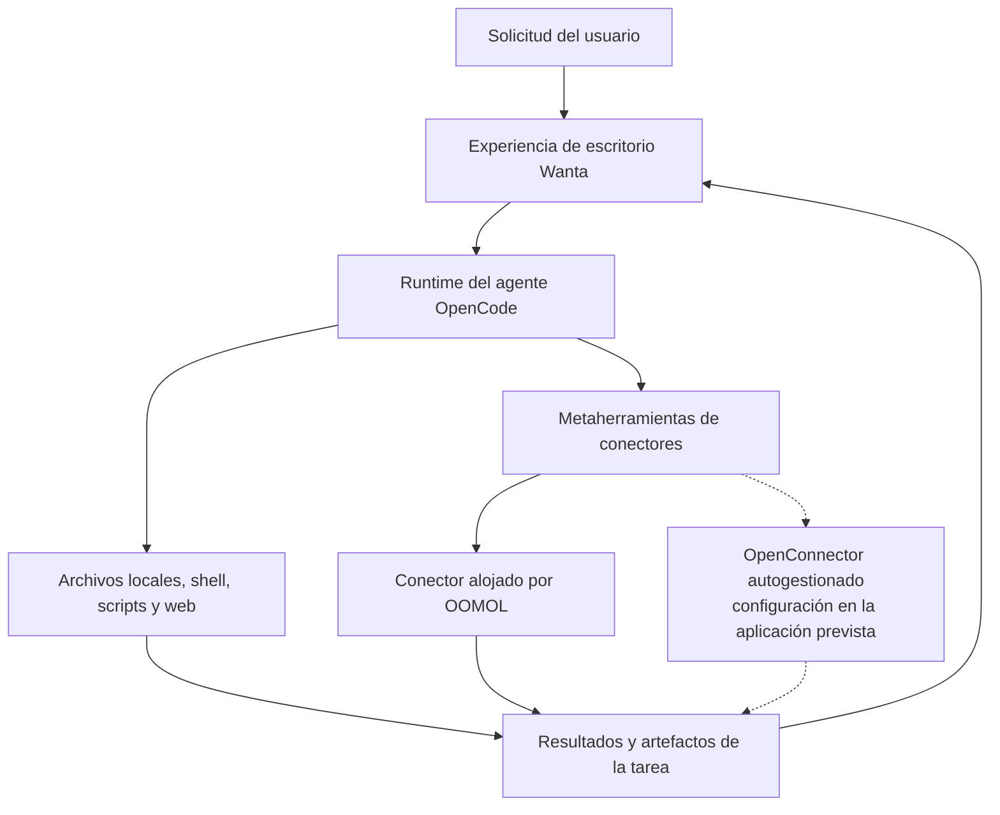

<div align="center">

[English](README.md) · [简体中文](README.zh-CN.md) · [日本語](README.ja.md) · **Español** · [한국어](README.ko.md)


# Wanta

**Una base de código abierto para crear agentes de IA de escritorio con OpenCode.**

Empieza con un producto funcional, no con una demostración de interfaz de chat. Wanta reúne un
entorno de ejecución para agentes, herramientas locales, controles de permisos, servicios conectados,
artefactos y una interfaz de escritorio multiplataforma cuidada.

[Sitio web](https://wanta.ai/) · [OpenConnector](https://github.com/oomol-lab/open-connector) ·
[Documentación](docs/project-overview.md) · [Guía de desarrollo](docs/development.md)

[](LICENSE)


</div>

<p align="center">
  
</p>

<p align="center"><em>De una tarea en un servicio conectado a un artefacto interactivo y reutilizable, dentro del mismo espacio de trabajo.</em></p>

Wanta ha sido creado por [OOMOL](https://oomol.com/) para quienes desean desarrollar agentes de
escritorio útiles sin reconstruir toda la infraestructura de producto que rodea el ciclo del agente.
Haz un fork, sustituye el modelo, las instrucciones, las herramientas, los conectores, la interfaz y
la marca, y publica un agente para tu propio producto o flujo de trabajo.

También puedes usar Wanta tal como está: ejecútalo localmente con tu propio modelo compatible con
OpenAI o inicia sesión para usar modelos alojados por OOMOL, conectores, autorización OAuth y espacios
de trabajo de equipo.

## Por qué hicimos Wanta de código abierto

Una demostración convincente de un agente puede comenzar con un modelo y un campo de chat. Un agente
de escritorio en el que se pueda confiar necesita mucho más: gestión del ciclo de vida del runtime,
eventos en streaming, controles de acceso local, credenciales seguras para modelos, sesiones y
proyectos, actividad de herramientas, archivos como artefactos, recuperación, empaquetado y una
interfaz que permita comprender el trabajo autónomo.

Nadie debería tener que reconstruir todo eso antes de trabajar en la capacidad que hace único a su
agente. Wanta abre la base de escritorio completa para que puedas:

- usar OpenCode como runtime para agentes más allá del desarrollo de software;
- crear herramientas, Skills, instrucciones y flujos de trabajo específicos de un dominio;
- combinar trabajo local en el equipo con acciones SaaS autenticadas;
- distribuir un producto de escritorio con tu marca, no solo un prototipo para desarrolladores;
- elegir cuánta infraestructura quieres operar por tu cuenta.

## Qué puedes crear

Wanta es hoy un agente de trabajo general, pero su arquitectura está pensada para adaptarse. Puede
convertirse en un agente de operaciones, investigación, soporte, comercio electrónico o conocimiento
empresarial, una herramienta interna u otro producto de escritorio vertical.

| Punto de partida                                                                 | Hazlo tuyo                                                               |
| -------------------------------------------------------------------------------- | ------------------------------------------------------------------------ |
| Runtime de agente OpenCode gestionado como sidecar local aislado                 | Sustituye el rol, las instrucciones, los modos y los permisos del agente |
| Archivos locales, shell, scripts, búsqueda y acceso web                          | Añade herramientas para tu producto, sector o sistemas internos          |
| Modelos personalizados compatibles con OpenAI y modelos alojados por OOMOL       | Incorpora tu propio catálogo de modelos y proveedores predeterminados    |
| Chat en streaming, actividad de herramientas, aprobaciones, preguntas y adjuntos | Rediseña el flujo de trabajo conservando la integración con el runtime   |
| Gestión de los artefactos generados                                              | Añade resultados, vistas previas y acciones específicas del producto     |
| Empaquetado y actualizaciones multiplataforma con Electron                       | Aplica tu nombre, identidad, distribución y proceso de publicación       |
| Descubrimiento y ejecución de acciones SaaS compatibles con OpenConnector        | Conecta tus propios Providers o usa el ecosistema alojado de conectores  |

## Wanta en acción

Wanta puede razonar, inspeccionar proyectos y archivos, ejecutar comandos y scripts, acceder a la web
y usar acciones SaaS autenticadas cuando una tarea necesita datos privados de una cuenta. La ejecución
de herramientas se muestra en streaming dentro de la conversación para que la persona vea qué hace el agente.

Las acciones locales de alto riesgo pasan por un flujo de permisos explícito. El agente también puede
detenerse para solicitar información mediante preguntas estructuradas. Los modos Build y Plan ofrecen
contratos de ejecución distintos, y se puede elegir el modelo, nivel de razonamiento, proyecto y modo
de acceso para cada tarea.

Los archivos generados permanecen vinculados a la tarea en vez de perderse en la conversación. Wanta
puede abrir y revisar código, texto, imágenes, PDF, documentos de Word y libros de cálculo interactivos
completos en el panel de artefactos.

La experiencia alojada opcional añade conexiones de cuentas administradas y espacios de trabajo de
equipo sin entregar al agente las credenciales almacenadas de los Providers. Los equipos pueden
compartir conexiones y Skills, controlar el acceso a Providers y gestionar el uso sin operar su propia
infraestructura de identidad, credenciales OAuth y gobernanza.

## Elige tu opción

Wanta separa la base de escritorio de código abierto de los servicios alojados opcionales. Elige la
opción que corresponda con aquello que deseas operar.

| Tu objetivo                                                   | Opción recomendada                                                                                                                       |
| ------------------------------------------------------------- | ---------------------------------------------------------------------------------------------------------------------------------------- |
| Ejecutar un agente de escritorio privado con tu propio modelo | Usa el espacio **Local BYOK**. No requiere una cuenta de Wanta.                                                                          |
| Crear un agente de escritorio para tu producto                | Haz un fork de Wanta y personaliza el agente, herramientas, modelos, UI y marca.                                                         |
| Conectar tu propio despliegue de OpenConnector                | Hoy puedes compilar una distribución para un endpoint compatible. La configuración autogestionada dentro de la aplicación está prevista. |
| Usar modelos gestionados y conexiones SaaS autenticadas       | Inicia sesión en Wanta y utiliza los servicios alojados por OOMOL.                                                                       |
| Compartir conectores, Skills, acceso y uso con un equipo      | Usa un espacio de trabajo de equipo alojado de Wanta.                                                                                    |

### Modos de ejecución

| Modo                         | Cuenta necesaria          | Modelos                                           | Herramientas locales | Conectores                     | Funciones de equipo         |
| ---------------------------- | ------------------------- | ------------------------------------------------- | -------------------- | ------------------------------ | --------------------------- |
| Local BYOK                   | No                        | Proveedores personalizados compatibles con OpenAI | Sí                   | No disponibles                 | No                          |
| Wanta alojado                | Sí                        | Modelos de OOMOL y proveedores personalizados     | Sí                   | Ecosistema OOMOL/OpenConnector | Sí                          |
| OpenConnector autogestionado | Previsto en la aplicación | Definidos por el despliegue                       | Sí                   | Previsto                       | Definidas por el despliegue |

Las sesiones, proyectos y preferencias de modelos locales siguen disponibles después de cerrar sesión
o cuando caduca una sesión de OOMOL. Wanta no sube silenciosamente sesiones locales a un espacio de
trabajo de equipo de OOMOL.

La opción actual `WANTA_ENDPOINT` es una **configuración de distribución en tiempo de compilación**, no
un selector para el usuario durante la ejecución. Determina todo el entorno de servicios compatible,
no solo una URL base del conector. El flujo de URL base de aplicación y Runtime Token opcional para
OpenConnector autogestionado aparece como función futura y todavía no está completo.

## Crea tu propio agente

Wanta usa OpenCode como runtime local con versión fijada y lo personaliza sin mantener un fork de su
código fuente. El proceso principal de escritorio controla el sidecar mediante HTTP y SSE; Wanta
proporciona el contrato del agente, modelos, permisos, herramientas, sesiones, UI e integración de escritorio.

### Motor del agente: OpenCode

La aplicación inicia el binario fijado `opencode-ai@1.17.13` como un sidecar `opencode serve` limitado
al loopback y lo controla con `@opencode-ai/sdk@1.17.13`. Los paquetes de OpenCode usan licencia MIT y
se reconocen en [THIRD_PARTY_NOTICES.md](THIRD_PARTY_NOTICES.md). Wanta fija el runtime, el SDK y el
plugin a la misma versión exacta porque sus API no se consideran estables.

Los principales puntos de extensión son:

| Área                                             | Empieza aquí                                                         |
| ------------------------------------------------ | -------------------------------------------------------------------- |
| Identidad y contrato operativo del agente        | [`electron/agent/system-prompt.ts`](electron/agent/system-prompt.ts) |
| Modos, modelos, herramientas y permisos          | [`electron/agent/config.ts`](electron/agent/config.ts)               |
| Conectores y herramientas específicas de dominio | [`electron/agent/tool-sources.ts`](electron/agent/tool-sources.ts)   |
| Modelos integrados y personalizados              | [`electron/models/`](electron/models/)                               |
| Experiencia de chat y artefactos                 | [`src/routes/Chat/`](src/routes/Chat/)                               |
| Experiencia de conexiones                        | [`src/routes/Connections/`](src/routes/Connections/)                 |
| Identidad de la aplicación                       | [`electron/branding.ts`](electron/branding.ts)                       |

La capacidad del agente es un único contrato de producto expresado en tres lugares: herramientas
habilitadas, reglas de permisos e instrucciones del sistema. Modifícalos juntos para mantener alineados
el comportamiento, la seguridad y las expectativas de la UI. Lee la [guía de arquitectura](docs/architecture.md)
y las [convenciones de código](docs/conventions.md) antes de cambiar estos límites.

## Cómo funciona



Wanta evita registrar cientos de herramientas específicas de Providers en el contexto del modelo. Su
integración de conectores utiliza descubrimiento progresivo:

```text
listar aplicaciones conectadas → buscar una Action → inspeccionar su esquema → ejecutarla con parámetros validados
```

Así se mantiene pequeña la superficie de herramientas, se explicita el contrato de cada Action y los
errores de autorización regresan como estados estructurados del producto, no como texto libre del modelo.

### OpenCode, OpenConnector, Wanta y OOMOL

- **OpenCode** es el runtime local del agente. Wanta gestiona su ciclo de vida y aporta configuración,
  permisos, instrucciones y herramientas personalizadas.
- **OpenConnector** es el proyecto hermano de código abierto para crear y ejecutar Providers en el
  ecosistema compartido de conectores.
- **Wanta** es el producto de agente de escritorio y la base de aplicación reutilizable de este repositorio.
- **OOMOL** proporciona la capa alojada opcional para inicio de sesión, modelos, credenciales de
  conectores, OAuth, equipos, Skills, uso, facturación y distribución.

El núcleo Local BYOK no requiere una cuenta de OOMOL. Iniciar sesión habilita los conectores alojados y
la capa de equipo; no es necesario para inspeccionar, bifurcar o desarrollar la aplicación de escritorio.

Consulta la [guía de arquitectura](docs/architecture.md) para conocer el diseño completo de procesos,
límites de confianza, IPC, streaming, autenticación y almacenamiento.

## Ejecutar desde el código fuente

Requisitos: Node.js 22.22.2 o posterior y npm.

```bash
git clone https://github.com/oomol-lab/wanta.git
cd wanta
npm install
npm run dev
```

Esta es la ruta más corta para probar el repositorio. La configuración del entorno, los comandos de
prueba, la verificación del runtime, el empaquetado, la firma y los procesos de publicación están en la
[Guía de desarrollo](docs/development.md).

## Seguridad y límites de datos

- OpenCode solo escucha en loopback y usa una contraseña de servidor aleatoria por proceso.
- Los tokens de sesión de OOMOL y las claves de API de modelos personalizados tienen almacenamiento y ciclos de vida separados.
- Las claves de modelos se cifran con `safeStorage` de Electron y nunca se devuelven al renderer.
- Las credenciales de conectores permanecen en el entorno alojado o autogestionado elegido; el agente recibe resultados de acciones, no credenciales almacenadas de Providers.
- Las operaciones locales de alto riesgo están conectadas con la UI de aprobación explícita de Wanta.
- Las sesiones locales no se suben silenciosamente a un espacio de trabajo de equipo de OOMOL.

Consulta [SECURITY.md](SECURITY.md) para informar vulnerabilidades de forma privada y la
[guía de arquitectura](docs/architecture.md) para los límites de confianza completos.

## Mapa del proyecto

| Ruta                                       | Propósito                                                                |
| ------------------------------------------ | ------------------------------------------------------------------------ |
| [`electron/`](electron/)                   | Proceso principal, preload, runtime del agente y servicios de escritorio |
| [`src/`](src/)                             | Renderer de React, rutas, hooks y componentes de UI                      |
| [`scripts/`](scripts/)                     | Desarrollo, preparación de binarios, empaquetado y publicación           |
| [`resources/`](resources/)                 | Marca y recursos incluidos con la aplicación                             |
| [`docs/`](docs/)                           | Producto, arquitectura, desarrollo, convenciones y decisiones            |
| [`.github/workflows/`](.github/workflows/) | Automatización de pull requests y publicaciones                          |

La pila incluye Electron 42, Vite 8, React 19, Tailwind CSS 4, OpenCode, TypeScript, Vitest, oxlint y
oxfmt. Wanta se empaqueta para macOS, Windows y Linux.

## Documentación

- [Descripción del proyecto](docs/project-overview.md) — alcance del producto y relaciones del ecosistema
- [Arquitectura](docs/architecture.md) — procesos, runtime, IPC, streaming, autenticación y flujo de datos
- [Guía de desarrollo](docs/development.md) — instalación, ejecución, pruebas, empaquetado, firma y publicación
- [Convenciones de código](docs/conventions.md) — reglas de implementación y límites de seguridad
- [Decisiones técnicas clave](docs/key-decisions.md) — motivos de la arquitectura
- [Guía de contribución](CONTRIBUTING.md) — ramas, pull requests, verificación y normas de contribución
- [Política de seguridad](SECURITY.md) — comunicación privada de vulnerabilidades
- [Política de marcas](TRADEMARKS.md) y [avisos de terceros](THIRD_PARTY_NOTICES.md)

## Contribuir

Los issues y pull requests son bienvenidos. Antes de realizar un cambio importante de comportamiento
o interfaz, abre un issue para acordar primero la dirección y el alcance del producto. Lee
[CONTRIBUTING.md](CONTRIBUTING.md) antes de abrir un pull request; contiene el flujo de trabajo del
repositorio, las verificaciones necesarias y los límites de seguridad que deben preservar las contribuciones.

Al enviar una contribución, aceptas que se proporciona bajo la Licencia Apache, Versión 2.0, salvo que
indiques claramente lo contrario por escrito.

## Alcance de la licencia

Salvo indicación en contrario, el código fuente, los scripts, las pruebas y la documentación creados
para este repositorio se publican bajo la [Licencia Apache, Versión 2.0](LICENSE).

Esta licencia no concede derechos sobre productos, servicios, API, marcas, nombres comerciales,
logotipos, iconos, capturas de pantalla ni otros materiales de terceros que pertenecen a sus respectivos
titulares. Los nombres y materiales de terceros se utilizan únicamente para identificación e
interoperabilidad; su inclusión no implica respaldo, patrocinio ni asociación.
