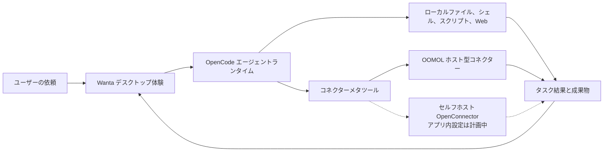

<div align="center">

[English](README.md) · [简体中文](README.zh-CN.md) · **日本語** · [Español](README.es.md) · [한국어](README.ko.md)


# Wanta

**OpenCode でデスクトップ AI エージェントを構築するためのオープンソース基盤。**

チャット UI のデモではなく、実際に動くプロダクトから始められます。Wanta はエージェント
ランタイム、ローカルツール、権限制御、接続サービス、成果物、洗練されたクロスプラットフォーム
デスクトップ UI をひとつにまとめます。

[Web サイト](https://wanta.ai/) · [OpenConnector](https://github.com/oomol-lab/open-connector) ·
[ドキュメント](docs/project-overview.md) · [開発ガイド](docs/development.md)

[](LICENSE)


</div>

> **TODO：ここに 20〜30 秒の製品動画または GIF を追加してください。** ユーザーが Wanta に
> タスクを依頼し、エージェントがローカルまたは接続済みツールを使用し、権限・ツール操作を経て、
> 完成したファイルを成果物パネルで開くまでを見せます。

Wanta は、エージェントループを取り巻く製品基盤を一から作り直すことなく、実用的な
デスクトップエージェントを作りたい開発者のために [OOMOL](https://oomol.com/) が開発しました。
フォークしてモデル、プロンプト、ツール、コネクター、UI、ブランドを置き換え、独自の製品や
ワークフロー向けエージェントをリリースできます。

Wanta をそのまま利用することもできます。独自の OpenAI 互換モデルでローカル実行するか、
サインインして OOMOL がホストするモデル、コネクター、OAuth 認証、チームワークスペースを
利用できます。

## Wanta をオープンソース化した理由

説得力のあるエージェントデモは、モデルとチャット入力だけでも始められます。しかし、人が
安心して使えるデスクトップエージェントには、ランタイムのライフサイクル管理、ストリーミング
イベント、ローカルアクセス制御、安全なモデル認証情報、セッションとプロジェクト、ツール操作、
ファイル成果物、リカバリー、パッケージング、自律的な処理を理解できる UI などが必要です。

開発者は、エージェント独自の能力に取り組む前に、これらすべてを作り直すべきではありません。
Wanta は完全なデスクトップ基盤を公開し、次のことを可能にします。

- OpenCode をソフトウェア開発以外のエージェントにも活用する
- ドメイン固有のツール、Skills、プロンプト、ワークフローを構築する
- ローカルコンピューター上の作業と認証済み SaaS 操作を組み合わせる
- 開発者向けプロトタイプではなく、独自ブランドのデスクトップ製品を配布する
- 運用するインフラの範囲を自分で選ぶ

## 構築できるもの

Wanta は現在、汎用ワークエージェントですが、アーキテクチャはカスタマイズを前提としています。
運用、調査、サポート、EC、企業ナレッジ向けのエージェント、社内ツール、その他の業界特化型
デスクトップ製品へ発展させられます。

| 最初から備わっているもの                                                    | 独自にカスタマイズできるもの                             |
| --------------------------------------------------------------------------- | -------------------------------------------------------- |
| 分離されたローカル Sidecar として管理される OpenCode エージェントランタイム | エージェントの役割、指示、モード、権限を変更             |
| ローカルファイル、シェル、スクリプト、検索、Web アクセス                    | 製品、業界、社内システム向けツールを追加                 |
| OpenAI 互換カスタムモデルと OOMOL ホストモデル                              | 独自のモデルカタログと既定プロバイダーを導入             |
| ストリーミングチャット、ツール操作、承認、質問、添付ファイル                | ランタイム連携を保ちながらワークフローを再設計           |
| 生成物の成果物管理                                                          | 製品固有の出力、プレビュー、操作を追加                   |
| クロスプラットフォーム Electron パッケージングと更新                        | 独自の名称、アイデンティティ、配布、リリース手順を適用   |
| OpenConnector 互換の SaaS Action 検索・実行                                 | 独自 Provider またはホスト型コネクターエコシステムに接続 |

## Wanta の動作を見る

### ローカルツールと接続サービスを横断して作業

Wanta は推論、プロジェクトやファイルの調査、コマンドやスクリプトの実行、Web アクセスを
直接行い、非公開アカウントデータが必要なタスクでは認証済み SaaS Action を利用できます。
ツール実行は会話にストリーミングされ、エージェントの作業内容をユーザーが確認できます。

> **TODO：メインのチャット画面を示す横長のスクリーンショットを追加してください。** 現実的な
> 複数ステップのタスク、ツール操作、サイドバー、成果物パネルを含めます。

### ユーザーが常に主導権を維持

リスクの高いローカル操作は明示的な権限フローを通過します。情報が不足している場合、
エージェントは構造化された質問で処理を一時停止できます。Build と Plan モードは異なる
実行契約を持ち、タスクごとにモデル、推論レベル、プロジェクト、アクセスモードを選択できます。

> **TODO：ローカルアクセスの権限カードまたは構造化質問を示す画像を追加してください。**

### 作業を再利用可能な成果物へ

生成ファイルは会話の中に埋もれず、タスクに添付されたまま残ります。Wanta はコード、テキスト、
画像、PDF、Word 文書、完全に操作可能なスプレッドシートを成果物パネルで開いて確認できます。

> **TODO：見栄えの良い出力を表示する成果物パネルの画像を追加してください。** 単純なテキスト
> よりも、スプレッドシートや生成 PDF のほうが効果的です。

### 認証情報をエージェントに渡さずアカウントを接続

ホスト型の接続機能は OAuth2、API キー、カスタム認証情報、フェデレーション認証情報、
認証不要の Provider をサポートします。ひとつのワークスペースで同じ Provider の複数アカウントを
保持でき、エージェントは構造化ツールを通じて選択済み接続を識別・使用します。

> **TODO：接続カタログと、複数アカウントを持つ Provider 詳細画面を追加してください。**

### チームで作業を整理

Wanta にサインインすると、チームはワークスペース、メンバー、共有接続、メンバーごとの Provider
アクセス、チーム Skills、使用量、サブスクリプション、シートを管理できます。ホスト型の選択肢は、
ID、OAuth 認証情報、ガバナンス基盤を自前で運用したくない開発者やチーム向けです。

> **TODO：メンバーと Provider アクセス制御を示すチーム管理画面を追加してください。**

## 利用方法を選ぶ

Wanta は、オープンソースのデスクトップ基盤とオプションのホストサービスを分離しています。
運用したい範囲に合う方法を選択してください。

| 目的                                                     | 推奨方法                                                                                                 |
| -------------------------------------------------------- | -------------------------------------------------------------------------------------------------------- |
| 独自モデルでプライベートなデスクトップエージェントを実行 | **Local BYOK** ワークスペースを使用。Wanta アカウントは不要です。                                        |
| 独自製品向けデスクトップエージェントを構築               | Wanta をフォークし、エージェント、ツール、モデル、UI、ブランドをカスタマイズ。                           |
| 独自の OpenConnector デプロイに接続                      | 現在は互換エンドポイント向けにディストリビューションをビルド可能。アプリ内セルフホスト設定は計画中です。 |
| マネージドモデルと認証済み SaaS 接続を使用               | Wanta にサインインし、OOMOL ホストサービスを使用。                                                       |
| コネクター、Skills、アクセス、使用量をチームで共有       | ホスト型 Wanta チームワークスペースを使用。                                                              |

### ランタイムモード

| モード                    | アカウント         | モデル                          | ローカルツール | コネクター                       | チーム機能     |
| ------------------------- | ------------------ | ------------------------------- | -------------- | -------------------------------- | -------------- |
| Local BYOK                | 不要               | カスタム OpenAI 互換 Provider   | 利用可         | 利用不可                         | なし           |
| Wanta hosted              | 必要               | OOMOL モデルとカスタム Provider | 利用可         | OOMOL/OpenConnector エコシステム | あり           |
| Self-hosted OpenConnector | アプリ対応は計画中 | デプロイで定義                  | 利用可         | 計画中                           | デプロイで定義 |

サインアウト後や OOMOL セッション失効後も、ローカルのセッション、プロジェクト、モデル設定は
利用できます。Wanta がローカルセッションを無断で OOMOL チームワークスペースへアップロードする
ことはありません。

現在の `WANTA_ENDPOINT` は**ビルド時のディストリビューション設定**であり、エンドユーザー向けの
ランタイムスイッチではありません。Connector Base URL だけでなく、互換サービス環境全体を
決定します。セルフホスト OpenConnector 用のアプリレベル Base URL とオプションの Runtime Token
フローは、近日提供予定の画面として表示されていますが、まだ完成していません。

## 独自のエージェントを構築

Wanta は OpenCode を固定バージョンのローカルランタイムとして使用し、OpenCode のソースを
フォークせずにカスタマイズします。デスクトップのメインプロセスが HTTP と SSE で Sidecar を
制御し、Wanta がエージェント契約、モデル、権限、ツール、セッション、製品 UI、デスクトップ
連携を提供します。

### エージェントエンジン：OpenCode

アプリは固定バージョンの `opencode-ai@1.17.13` バイナリをループバック専用の
`opencode serve` Sidecar として起動し、`@opencode-ai/sdk@1.17.13` から操作します。
OpenCode パッケージは MIT ライセンスで、[THIRD_PARTY_NOTICES.md](THIRD_PARTY_NOTICES.md)
に記載されています。API は安定版として扱われないため、ランタイム、SDK、プラグインを同じ
正確なバージョンに固定しています。

主な拡張ポイント：

| 領域                                     | 参照先                                                               |
| ---------------------------------------- | -------------------------------------------------------------------- |
| エージェントのアイデンティティと動作契約 | [`electron/agent/system-prompt.ts`](electron/agent/system-prompt.ts) |
| モード、モデル、ツール、権限             | [`electron/agent/config.ts`](electron/agent/config.ts)               |
| コネクターとドメイン固有ツール           | [`electron/agent/tool-sources.ts`](electron/agent/tool-sources.ts)   |
| 組み込み・カスタムモデル対応             | [`electron/models/`](electron/models/)                               |
| チャットと成果物の体験                   | [`src/routes/Chat/`](src/routes/Chat/)                               |
| 接続体験                                 | [`src/routes/Connections/`](src/routes/Connections/)                 |
| アプリケーションのアイデンティティ       | [`electron/branding.ts`](electron/branding.ts)                       |

エージェントの能力は、有効なツール、権限ルール、システムプロンプトの 3 か所に表現される
ひとつの製品契約です。ランタイムの動作、安全性、UI の期待が一致するよう、必ず同時に変更して
ください。これらの境界を変更する前に、[アーキテクチャガイド](docs/architecture.md)と
[コード規約](docs/conventions.md)をお読みください。

## 仕組み



Wanta はモデルコンテキストへ何百もの Provider 固有ツールを登録せず、段階的な探索を行います。

```text
接続済みアプリを一覧表示 → Action を検索 → スキーマを確認 → 検証済みパラメーターで実行
```

これによりツール範囲を小さく保ち、Action の契約を明確にし、認証エラーを自由形式のモデル文では
なく構造化された製品状態として返せます。

### OpenCode、OpenConnector、Wanta、OOMOL

- **OpenCode** はローカルのエージェントランタイムです。Wanta がライフサイクルを管理し、
  設定、権限、プロンプト、カスタムツールを提供します。
- **OpenConnector** は共有コネクターエコシステムの Provider を構築・実行するオープンソースの
  姉妹プロジェクトです。
- **Wanta** はデスクトップエージェント製品であり、このリポジトリの再利用可能なアプリ基盤です。
- **OOMOL** は、サインイン、モデル、コネクター認証情報、OAuth、チーム、Skills、使用量、
  請求、配布のためのオプションのホスト層を提供します。

Local BYOK のコア機能に OOMOL アカウントは不要です。サインインするとホスト型コネクターと
チーム機能が有効になりますが、デスクトップアプリの閲覧、フォーク、開発には必要ありません。

プロセス、信頼境界、IPC、ストリーミング、認証、ストレージ設計の詳細は
[アーキテクチャガイド](docs/architecture.md)をご覧ください。

## ソースから実行

必要環境：Node.js 22.22.2 以降と npm。

```bash
git clone https://github.com/oomol-lab/wanta.git
cd wanta
npm install
npm run dev
```

これがリポジトリを試す最短手順です。環境設定、テストコマンド、ランタイム検証、パッケージング、
署名、リリースフローは[開発ガイド](docs/development.md)をご覧ください。

## セキュリティとデータ境界

- OpenCode はループバックのみで待ち受け、プロセスごとにランダムなサーバーパスワードを使用します。
- OOMOL セッショントークンとカスタムモデル API キーは別々に保存・管理されます。
- カスタムモデルキーは Electron `safeStorage` で暗号化され、レンダラープロセスへ返されません。
- コネクター認証情報は選択したホスト環境または自前運用環境に留まり、エージェントは保存済みの
  Provider 認証情報ではなく Action の結果だけを受け取ります。
- リスクの高いローカル操作は Wanta の明示的な承認 UI に接続されます。
- ローカルセッションが無断で OOMOL チームワークスペースへアップロードされることはありません。

脆弱性の非公開報告については [SECURITY.md](SECURITY.md)、完全な信頼境界については
[アーキテクチャガイド](docs/architecture.md)をご覧ください。

## プロジェクト構成

| パス                                       | 用途                                                                  |
| ------------------------------------------ | --------------------------------------------------------------------- |
| [`electron/`](electron/)                   | メインプロセス、Preload、エージェントランタイム、デスクトップサービス |
| [`src/`](src/)                             | React レンダラー、ルート、Hooks、UI コンポーネント                    |
| [`scripts/`](scripts/)                     | 開発、バイナリ準備、パッケージング、リリース支援                      |
| [`resources/`](resources/)                 | アプリに同梱するブランド素材とリソース                                |
| [`docs/`](docs/)                           | 製品、アーキテクチャ、開発、規約、意思決定の記録                      |
| [`.github/workflows/`](.github/workflows/) | Pull Request とリリースの自動化                                       |

技術スタックは Electron 42、Vite 8、React 19、Tailwind CSS 4、OpenCode、TypeScript、
Vitest、oxlint、oxfmt です。Wanta は macOS、Windows、Linux 向けにパッケージ化できます。

## ドキュメント

- [プロジェクト概要](docs/project-overview.md) — 製品範囲とエコシステムの関係
- [アーキテクチャ](docs/architecture.md) — プロセス、ランタイム、IPC、ストリーミング、認証、データフロー
- [開発ガイド](docs/development.md) — インストール、実行、テスト、パッケージ、署名、リリース
- [コード規約](docs/conventions.md) — 実装ルールとセキュリティ境界
- [主要な技術判断](docs/key-decisions.md) — このアーキテクチャになった理由
- [コントリビューションガイド](CONTRIBUTING.md) — ブランチ、Pull Request、検証、コントリビューションルール
- [セキュリティポリシー](SECURITY.md) — 脆弱性の非公開報告
- [商標ポリシー](TRADEMARKS.md)と[サードパーティ通知](THIRD_PARTY_NOTICES.md)

## コントリビューション

Issue と Pull Request を歓迎します。動作や UI に大きな変更を加える前に Issue を作成し、
製品の方向性と範囲について合意してください。Pull Request を作成する前に
[CONTRIBUTING.md](CONTRIBUTING.md)をお読みください。リポジトリのワークフロー、必要な検証、
コントリビューションで維持すべきセキュリティ境界が記載されています。

コントリビューションを提出すると、書面で明記しない限り、Apache License 2.0 の下で提供する
ことに同意したものとみなされます。

## ライセンスの範囲

別途記載がない限り、このリポジトリ向けに作成されたソースコード、スクリプト、テスト、文書は
[Apache License 2.0](LICENSE)の下でライセンスされます。

このライセンスは、それぞれの権利者が所有する第三者の製品、サービス、API、商標、商号、ロゴ、
アイコン、スクリーンショット、その他の素材に対する権利を許諾するものではありません。第三者の
名称と素材は識別および相互運用の目的でのみ使用されており、掲載は推奨、支援、提携を意味しません。
