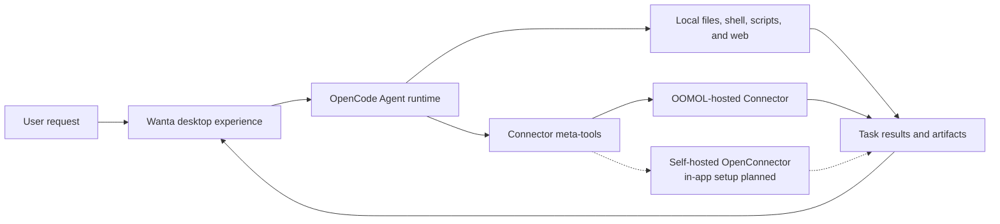

<div align="center">


# Wanta

**An open-source foundation for building desktop AI agents with OpenCode.**

Start with a working product—not a chat UI demo. Wanta brings together an Agent runtime, local tools,
permission controls, connected services, artifacts, and a polished cross-platform desktop interface.

[Website](https://wanta.ai/) · [OpenConnector](https://github.com/oomol-lab/open-connector) ·
[Documentation](docs/project-overview.md) · [Development Guide](docs/development.md)

[](LICENSE)


</div>

> **TODO: Add a 20–30 second product video or GIF here.** Show a user asking Wanta to complete a
> task, the Agent using a local or connected tool, a permission/tool activity step, and the resulting
> file opening in the Artifacts panel.

Wanta is built by [OOMOL](https://oomol.com/) for developers who want to create useful desktop Agents
without rebuilding the product infrastructure around the Agent loop. Fork it, replace the model,
prompt, tools, connectors, interface, and brand, then ship an Agent for your own product or workflow.

You can also use Wanta as it is: run locally with your own OpenAI-compatible model, or sign in to use
OOMOL-hosted models, connectors, OAuth authorization, and team workspaces.

## Why We Open-Sourced Wanta

A convincing Agent demo can begin with a model and a chat input. A desktop Agent people can rely on
needs much more: runtime lifecycle management, streaming events, local access controls, secure model
credentials, sessions and projects, tool activity, file artifacts, recovery, packaging, and a UI that
makes autonomous work understandable.

Developers should not have to rebuild all of that before working on the capability that makes their
Agent unique. Wanta opens up the complete desktop foundation so you can:

- use OpenCode as the runtime for Agents beyond software development;
- build domain-specific tools, Skills, prompts, and workflows;
- combine local computer work with authenticated SaaS actions;
- distribute a branded desktop product instead of a developer-only prototype;
- choose how much infrastructure to operate yourself.

## What You Can Build

Wanta is a general work Agent today, but the architecture is intended to be adapted. It can become an
operations Agent, research Agent, support Agent, ecommerce Agent, enterprise knowledge Agent, internal
tool, or another vertical desktop product.

| Start with                                                           | Make it yours                                                    |
| -------------------------------------------------------------------- | ---------------------------------------------------------------- |
| OpenCode Agent runtime managed as an isolated local sidecar          | Replace the Agent role, instructions, modes, and permissions     |
| Local files, shell, scripts, search, and web access                  | Add tools for your product, industry, or internal systems        |
| OpenAI-compatible custom models and OOMOL-hosted models              | Bring your own model catalog and provider defaults               |
| Streaming chat, tool activity, approvals, questions, and attachments | Redesign the workflow while keeping the runtime integration      |
| Artifact handling for generated work                                 | Add product-specific outputs, previews, and actions              |
| Cross-platform Electron packaging and updates                        | Apply your own name, identity, distribution, and release process |
| OpenConnector-compatible SaaS action discovery and execution         | Connect your own Providers or use the hosted connector ecosystem |

## See Wanta in Action

### Work across local tools and connected services

Wanta can reason directly, inspect projects and files, run commands and scripts, access the web, and
use authenticated SaaS Actions when a task needs private account data. Tool execution streams into the
conversation so the user can see what the Agent is doing.

> **TODO: Add a wide screenshot of the main Chat view here.** Include a realistic multi-step task with
> visible tool activity and both the sidebar and Artifacts panel.

### Keep the user in control

High-risk local actions pass through an explicit permission flow. The Agent can also pause for missing
task information using structured question prompts. Build and Plan modes provide separate execution
contracts, and users can select the model, reasoning level, project, and access mode for the task.

> **TODO: Add a screenshot showing a local-access permission card or structured question prompt.**

### Turn work into reusable artifacts

Generated files remain attached to the task instead of disappearing into the conversation. Wanta can
open and review code, text, images, PDFs, Word documents, and full interactive spreadsheet workbooks in
the Artifacts panel.

> **TODO: Add a screenshot of the Artifacts panel previewing a visually strong output.** A spreadsheet
> workbook or a generated PDF would demonstrate more than a plain text file.

### Connect accounts without giving credentials to the Agent

The hosted connection experience supports OAuth2, API keys, custom credentials, federated credentials,
and providers that require no authentication. A workspace can hold multiple accounts for the same
Provider, while the Agent identifies and uses the selected connection through structured tooling.

> **TODO: Add a screenshot of the Connections catalog and a Provider detail view with multiple accounts.**

### Organize work with a team

When signed in to Wanta, teams can manage workspaces, members, shared connections, per-member Provider
access, team Skills, usage, subscriptions, and seats. The hosted path is for developers and teams that
want these capabilities without operating identity, OAuth credential, and governance infrastructure.

> **TODO: Add a screenshot of Team Management showing members and Provider access controls.**

## Choose Your Path

Wanta separates the open-source desktop foundation from optional hosted services. Pick the path that
matches what you want to operate.

| Your goal                                               | Recommended path                                                                                             |
| ------------------------------------------------------- | ------------------------------------------------------------------------------------------------------------ |
| Run a private desktop Agent with your own model         | Use the **Local BYOK** workspace. No Wanta account is required.                                              |
| Build a desktop Agent for your own product              | Fork Wanta and customize the Agent, tools, models, UI, and branding.                                         |
| Connect your own OpenConnector deployment               | Build a distribution against a compatible endpoint today. In-app self-hosted OpenConnector setup is planned. |
| Use managed models and authenticated SaaS connections   | Sign in to Wanta and use OOMOL-hosted services.                                                              |
| Share connectors, Skills, access, and usage with a team | Use a hosted Wanta team workspace.                                                                           |

### Runtime modes

| Mode                      | Account required | Models                             | Local tools | Connectors                    | Team features      |
| ------------------------- | ---------------- | ---------------------------------- | ----------- | ----------------------------- | ------------------ |
| Local BYOK                | No               | Custom OpenAI-compatible providers | Yes         | Unavailable                   | No                 |
| Wanta hosted              | Yes              | OOMOL models and custom providers  | Yes         | OOMOL/OpenConnector ecosystem | Yes                |
| Self-hosted OpenConnector | Planned in app   | Deployment-defined                 | Yes         | Planned                       | Deployment-defined |

Local sessions, projects, and model settings remain available after signing out or when an OOMOL
session expires. Wanta does not silently upload local sessions into an OOMOL team workspace.

The current `WANTA_ENDPOINT` option is a **build-time distribution setting**, not an end-user runtime
switch. It derives the complete compatible service environment, not only a Connector Base URL. The
application-level Base URL and optional Runtime Token flow for self-hosted OpenConnector is visible as
a coming-soon product surface and is not complete yet.

## Build Your Own Agent

Wanta uses OpenCode as a pinned local runtime and customizes it without maintaining an OpenCode source
fork. The desktop main process controls the sidecar over HTTP and SSE; Wanta supplies the Agent
contract, models, permissions, tools, sessions, product UI, and desktop integration.

### Agent Engine: OpenCode

The application starts the pinned `opencode-ai@1.17.13` binary as a loopback-only `opencode serve`
sidecar and drives it through `@opencode-ai/sdk@1.17.13`. The OpenCode packages are MIT-licensed and
acknowledged in [THIRD_PARTY_NOTICES.md](THIRD_PARTY_NOTICES.md). Wanta pins the runtime, SDK, and
plugin to the same exact version because their APIs are not treated as stable.

The most important extension points are:

| Area                                        | Start here                                                           |
| ------------------------------------------- | -------------------------------------------------------------------- |
| Agent identity and operating contract       | [`electron/agent/system-prompt.ts`](electron/agent/system-prompt.ts) |
| Agent modes, models, tools, and permissions | [`electron/agent/config.ts`](electron/agent/config.ts)               |
| Connector and domain-specific tools         | [`electron/agent/tool-sources.ts`](electron/agent/tool-sources.ts)   |
| Built-in and custom model support           | [`electron/models/`](electron/models/)                               |
| Chat and artifact experience                | [`src/routes/Chat/`](src/routes/Chat/)                               |
| Connection experience                       | [`src/routes/Connections/`](src/routes/Connections/)                 |
| Application identity                        | [`electron/branding.ts`](electron/branding.ts)                       |

Agent capability is one product contract expressed in three places: enabled tools, permission rules,
and the system prompt. Change them together so runtime behavior, safety, and UI expectations stay
aligned. Read the [architecture guide](docs/architecture.md) and
[code conventions](docs/conventions.md) before changing these boundaries.

## How It Works



Wanta avoids registering hundreds of Provider-specific tools in the model context. Its Connector
integration uses progressive discovery instead:

```text
list connected apps → search for an Action → inspect its schema → call it with validated parameters
```

This keeps the tool surface small, makes the action contract explicit, and lets authorization failures
return as structured product states instead of free-form model text.

### OpenCode, OpenConnector, Wanta, and OOMOL

- **OpenCode** is the local Agent runtime. Wanta manages its lifecycle and supplies the Agent
  configuration, permissions, prompts, and custom tools.
- **OpenConnector** is the open-source sibling for building and running Providers in the shared
  connector ecosystem.
- **Wanta** is the desktop Agent product and the reusable application foundation in this repository.
- **OOMOL** provides the optional hosted layer for sign-in, models, Connector credentials, OAuth,
  teams, Skills, usage, billing, and distribution.

The Local BYOK core does not require an OOMOL account. Signing in enables the hosted Connector and team
layer; it is not required to inspect, fork, or develop the desktop application.

For the complete process, trust-boundary, IPC, streaming, authentication, and storage design, read the
[architecture guide](docs/architecture.md).

## Run from Source

Requirements: Node.js 22.22.2 or newer and npm.

```bash
git clone https://github.com/oomol-lab/wanta.git
cd wanta
npm install
npm run dev
```

That is the short path for trying the repository. Environment configuration, test commands, runtime
verification, packaging, signing, and release workflows live in the
[Development Guide](docs/development.md).

## Security and Data Boundaries

- OpenCode listens only on loopback and uses a random per-process server password.
- OOMOL session tokens and custom model API keys have separate storage and lifecycles.
- Custom model keys are encrypted with Electron `safeStorage` and are never returned to the renderer.
- Connector credentials remain in the selected hosted or self-operated Connector environment; the
  Agent receives action results, not stored provider credentials.
- High-risk local operations are connected to Wanta's explicit approval UI.
- Local sessions are not silently uploaded into an OOMOL team workspace.

See [SECURITY.md](SECURITY.md) for private vulnerability reporting and the
[architecture guide](docs/architecture.md) for complete trust boundaries.

## Project Map

| Path                                       | Purpose                                                               |
| ------------------------------------------ | --------------------------------------------------------------------- |
| [`electron/`](electron/)                   | Main process, preload, Agent runtime, and desktop services            |
| [`src/`](src/)                             | React renderer, routes, hooks, and UI components                      |
| [`scripts/`](scripts/)                     | Development, binary preparation, packaging, and release support       |
| [`resources/`](resources/)                 | Branding and resources bundled with the application                   |
| [`docs/`](docs/)                           | Product, architecture, development, conventions, and decision records |
| [`.github/workflows/`](.github/workflows/) | Pull request and release automation                                   |

The stack is Electron 42, Vite 8, React 19, Tailwind CSS 4, OpenCode, TypeScript, Vitest, oxlint, and
oxfmt. Wanta packages for macOS, Windows, and Linux.

## Documentation

- [Project overview](docs/project-overview.md) — product scope and ecosystem relationships
- [Architecture](docs/architecture.md) — processes, Agent runtime, IPC, streaming, auth, and data flow
- [Development guide](docs/development.md) — install, run, test, package, sign, and release
- [Code conventions](docs/conventions.md) — implementation rules and security boundaries
- [Key technical decisions](docs/key-decisions.md) — why the architecture is shaped this way
- [Contributing guide](CONTRIBUTING.md) — branches, pull requests, verification, and contribution rules
- [Security policy](SECURITY.md) — private vulnerability reporting
- [Trademark policy](TRADEMARKS.md) and [third-party notices](THIRD_PARTY_NOTICES.md)

## Contributing

Issues and pull requests are welcome. Before making a substantial behavior or UI change, open an issue
so the product direction and scope can be agreed first. Read [CONTRIBUTING.md](CONTRIBUTING.md) before
opening a pull request; it contains the repository workflow, required verification, and the security
boundaries that contributions must preserve.

By submitting a contribution, you agree that it is provided under the Apache License, Version 2.0,
unless you clearly state otherwise in writing.

## License Scope

Unless otherwise noted, source code, scripts, tests, and documentation authored for this repository
are licensed under the [Apache License, Version 2.0](LICENSE).

This license does not grant rights to third-party products, services, APIs, trademarks, trade names,
logos, icons, screenshots, or other materials owned by their respective holders. Third-party names and
assets are used only for identification and interoperability; their inclusion does not imply
endorsement, sponsorship, or partnership.
