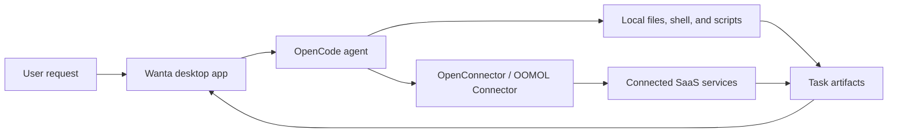

<div align="center">


# Wanta

**A desktop AI agent that works across your apps and local files.**

[](LICENSE)


[Website](https://wanta.ai/) · [OpenConnector](https://github.com/oomol-lab/open-connector) · [Documentation](docs/project-overview.md)

</div>

Wanta is an open-source desktop AI agent built by [OOMOL](https://oomol.com/). Describe what you
want to accomplish, and Wanta can plan the work, use connected SaaS services and local tools, and
return the result in a streaming conversation.

Wanta is designed for practical work across email, documents, analytics, project tools, files, and
other systems. It uses the same shared connector ecosystem as
[OpenConnector](https://github.com/oomol-lab/open-connector), while adding a desktop agent,
permission controls, conversation history, and artifact handling.

## What It Does

- Work across connected services using natural language instead of manually moving data between
  apps.
- Search, inspect, and run connector Actions while keeping service credentials outside the agent
  process.
- Read and write local files, run shell commands, and execute scripts with confirmation for
  high-risk operations.
- Stream responses and tool activity so the execution process remains visible.
- Preserve task outputs as artifacts that can be opened, reviewed, and reused.
- Run as a desktop application on macOS, Windows, and Linux.

## Where It Fits

Wanta is intended for people who regularly collect, compare, transform, or publish information
across multiple tools. Typical tasks include:

- Pulling analytics or operational data from several services and producing a summary.
- Organizing email, project, support, or knowledge-base information.
- Reading local documents and spreadsheets, then creating new files from the results.
- Automating repeatable workflows that combine SaaS Actions with local scripts.

## How It Works



The Electron main process manages the local agent sidecar, authentication, permissions, sessions,
and system integration. The React renderer provides the conversation, connection, settings, and
artifact interfaces. See [docs/architecture.md](docs/architecture.md) for the full design.

### Agent Engine: OpenCode

Wanta uses [OpenCode](https://github.com/anomalyco/opencode) as its local agent engine. The desktop
main process starts the pinned `opencode-ai@1.17.13` binary as a loopback-only `opencode serve`
sidecar and drives it through `@opencode-ai/sdk@1.17.13`. Wanta supplies the desktop UI, runtime
isolation, model configuration, permissions, sessions, Connector tools, and artifact handling;
OpenCode supplies the underlying agent loop and built-in local tools. The OpenCode packages are
MIT-licensed and are acknowledged in [THIRD_PARTY_NOTICES.md](THIRD_PARTY_NOTICES.md).

## Runtime Modes

| Mode            | Account required | Models                             | Local tools | Connectors             |
| --------------- | ---------------- | ---------------------------------- | ----------- | ---------------------- |
| Local BYOK      | No               | Custom OpenAI-compatible providers | Yes         | Hidden and unavailable |
| OOMOL signed in | Yes              | OOMOL models plus custom providers | Yes         | OOMOL/OpenConnector    |

Local sessions, projects, and model settings remain available when the user signs out or an OOMOL
session expires. Wanta does not silently upload local sessions into an OOMOL team workspace.

## Quick Start

### Requirements

- Node.js 22.22.2 or newer
- npm

### Run from Source

```bash
git clone https://github.com/oomol-lab/wanta.git
cd wanta
npm install
npm run dev
```

`npm install` prepares the Electron development runtime, the pinned OpenCode dependency, the `oo`
CLI, ripgrep, and bundled Skills. The Vite development server and Electron app start together with
`npm run dev`. The default desktop packages also include `oo`; local BYOK mode does not invoke its
Connector tools, so users can run the local core without separately installing or configuring the
CLI.

Hosted models and connected services currently require signing in to an OOMOL account from the
application. Each external service must also be authorized before Wanta can use its Actions.
Distributors operating an endpoint-compatible, self-hosted OpenConnector deployment can set
`WANTA_ENDPOINT` while building; see the [development guide](docs/development.md#2-env-配置). This
is a build-time distribution setting, not an end-user runtime switch.

### Use a Custom Model Without Signing In

1. Start Wanta and remain in the **Local workspace**.
2. Choose **Add model** from the empty-chat onboarding, or open **Settings → Models**.
3. Select a supported provider or an OpenAI-compatible custom endpoint.
4. Enter the model identifier and API key, then save the model.
5. Return to Chat and send a message after the local Agent reports that it is ready.

Custom-model API keys cross IPC only in the save request, are encrypted by Electron `safeStorage`,
and are never returned to the renderer. On Linux, Wanta requires a suitable secret-storage backend
such as GNOME Keyring or KWallet and refuses an insecure plaintext fallback.

## Security and Data Boundaries

- OpenCode listens only on loopback and uses a random per-process server password.
- Model credentials and the OOMOL session token have separate storage and lifecycles.
- The renderer receives capability summaries and redacted model metadata, never stored credentials.
- Connector credentials remain in the selected OpenConnector/OOMOL deployment; Wanta invokes
  actions through the bundled oo CLI.
- Risky local operations are connected to Wanta's explicit approval UI.

See [SECURITY.md](SECURITY.md) for private vulnerability reporting and
[docs/architecture.md](docs/architecture.md) for the complete trust boundaries.

## Development

| Command               | Purpose                                     |
| --------------------- | ------------------------------------------- |
| `npm run dev`         | Start the Vite and Electron development app |
| `npm run build`       | Type-check and build the application        |
| `npm run ts-check`    | Run TypeScript type checking                |
| `npm run lint`        | Check the code with oxlint                  |
| `npm run format`      | Check formatting with oxfmt                 |
| `npm test`            | Run the Vitest test suite                   |
| `npm run build:mac`   | Build the macOS package                     |
| `npm run build:win`   | Build the Windows package                   |
| `npm run build:linux` | Build the Linux package                     |

Before opening a pull request, run the complete quality gate:

```bash
npm run ts-check && npm run lint && npm run format && npm test
```

## Project Structure

| Path                 | Purpose                                                     |
| -------------------- | ----------------------------------------------------------- |
| `electron/`          | Electron main process, preload, agent, and desktop services |
| `src/`               | React renderer, routes, hooks, and UI components            |
| `scripts/`           | Development, binary preparation, and packaging scripts      |
| `resources/`         | Branding and resources bundled with the application         |
| `docs/`              | Architecture, development, conventions, and decisions       |
| `.github/workflows/` | Pull request and release automation                         |

The primary stack is Electron 42, Vite 8, React 19, Tailwind CSS 4, OpenCode, TypeScript, Vitest,
oxlint, and oxfmt.

## Documentation

- [Project overview](docs/project-overview.md)
- [Architecture](docs/architecture.md)
- [Development guide](docs/development.md)
- [Code conventions](docs/conventions.md)
- [Key technical decisions](docs/key-decisions.md)
- [Network request caching](docs/network-request-caching.md)
- [Contributing guide](CONTRIBUTING.md)
- [Security policy](SECURITY.md)
- [Trademark policy](TRADEMARKS.md)
- [Third-party notices](THIRD_PARTY_NOTICES.md)

## Contributing

Issues and pull requests are welcome. Before making changes, read [CONTRIBUTING.md](CONTRIBUTING.md),
the [development guide](docs/development.md), and the [code conventions](docs/conventions.md).
Create a short-lived branch from the latest `main`, keep the change focused, and include
appropriate tests when behavior changes.

By submitting a contribution, you agree that it is provided under the Apache License, Version 2.0,
unless you clearly state otherwise in writing.

## License Scope

Unless otherwise noted, source code, scripts, tests, and documentation authored for this repository
are licensed under the [Apache License, Version 2.0](LICENSE).

This license does not grant rights to third-party products, services, APIs, trademarks, trade names,
logos, icons, screenshots, or other materials owned by their respective holders. Third-party names
and assets are used only for identification and interoperability; their inclusion does not imply
endorsement, sponsorship, or partnership.
