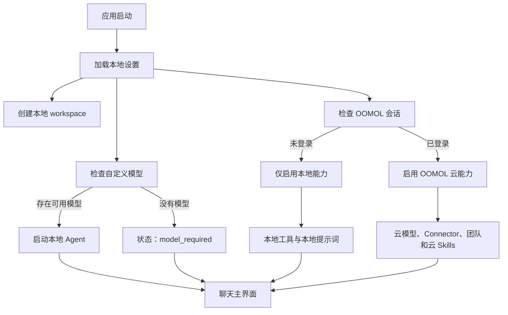

# Wanta 开源化与免登录模式实施计划

> 状态：Draft  
> 目标：将 Wanta 改造成默认免登录、支持 BYOK 和本地 Agent 能力的开源桌面应用；OOMOL 登录作为云模型、OpenConnector、团队、共享连接、云端 Skills 和账单等能力的可选增强入口。

## 1. 背景与目标

Wanta 当前是 OOMOL 出品的 Electron 桌面 AI Agent 客户端。聊天 UI、OpenCode sidecar、本地工具、权限确认、Artifact、文档预览、自定义模型和 OpenConnector 客户端能力已经具备较完整的产品形态，但应用入口、Agent 生命周期、会话作用域和云端能力都与 OOMOL 登录状态深度绑定。

开源的核心目的不是开放 OOMOL 全部云端基础设施，而是让社区能够：

- 参考和复用成熟的聊天 UI 与流式交互设计；
- 理解 Electron + OpenCode + 本地工具 + 权限 UI 的完整 Agent 开发范式；
- 在不注册 OOMOL 账号的情况下，通过自有模型 API 或本地兼容服务使用核心功能；
- 在主动登录 OOMOL 后，继续使用 OpenConnector 和其他官方托管能力。

目标产品应支持两种运行模式：

| 模式         | 是否登录 | 模型来源                    | 本地工具 | OpenConnector | 团队/账单 |
| ------------ | -------: | --------------------------- | -------: | ------------: | --------: |
| 本地社区模式 |   不需要 | 自定义 API / 本地兼容服务   |     支持 |        不支持 |    不支持 |
| OOMOL 云模式 |     需要 | OOMOL 内置模型 + 自定义模型 |     支持 |          支持 |      支持 |

第一版开源完成后必须满足：

- fresh clone 不需要 OOMOL 账号；
- fresh clone 不需要私有 npm PAT；
- 未登录可以进入主界面并管理本地数据；
- 配置自定义模型后可以聊天；
- 可以使用本地文件、Shell、项目、权限确认和 Artifact；
- 未登录时不向模型暴露 Connector 工具或 OOMOL workspace 语义；
- 登录后仍可使用现有 OOMOL 能力；
- 登出或会话过期不会使本地功能整体失效；
- 开源许可证、品牌边界、第三方依赖和凭证存储方式清晰。

## 2. 范围

### 2.1 第一版开源核心

- Electron 主进程、preload 和 React 渲染进程；
- 聊天 UI、流式消息、工具调用展示和消息操作；
- OpenCode sidecar 生命周期管理；
- Build / Plan 模式；
- 本地文件、Shell、项目和代码能力；
- OpenCode permission ask 与 Wanta 权限 UI 闭环；
- 本地会话和项目管理；
- 附件、Artifact、PDF、Word、图片和 Univer 表格预览；
- 自定义 OpenAI-compatible 模型；
- 本地 Skills 和不依赖 OOMOL 账号的知识能力；
- 本地 workspace；
- OOMOL 登录和 OpenConnector 的客户端实现；
- 开发、构建、测试、安全和贡献文档。

### 2.2 OOMOL 托管增强能力

以下能力可以继续由 OOMOL 提供托管服务，仓库仅包含客户端接入：

- OOMOL 内置模型和 Auto 模型；
- OpenConnector 服务端与托管凭证；
- 团队与共享 workspace；
- 团队共享连接；
- 云端 Skills 目录；
- 账单和使用量；
- OOMOL 自动更新分发基础设施。

### 2.3 第一版不包含

- 开源 OOMOL LLM 网关服务端；
- 开源 OpenConnector 服务端或凭证托管系统；
- 提供公共免费模型 API Key；
- 社区自行部署完整 OOMOL 后端；
- 自动将本地会话迁移到团队 workspace；
- 多设备同步本地会话；
- Web 版 Wanta；
- 完整的第三方 Connector 插件市场。

## 3. 产品与架构决策

实施默认采用以下决策：

| 决策                         | 方案                     | 原因                                   |
| ---------------------------- | ------------------------ | -------------------------------------- |
| 未登录是否能进入主界面       | 可以                     | 免登录模式的核心要求                   |
| 未配置模型时是否阻止进入应用 | 不阻止，只阻止发送       | 用户仍可浏览、管理设置和添加模型       |
| 未配置模型的 Agent 状态      | `model_required`         | 不应将模型缺失误报为退出登录           |
| 本地身份是否伪装成登录账号   | 不伪装                   | 避免 Auth、团队和账单语义混乱          |
| 本地 workspace               | 正式的一等 scope         | 避免长期以虚假 team 实现               |
| 登录后是否保留本地会话       | 保留                     | 本地和云端数据应并存                   |
| 是否自动上传或迁移本地会话   | 不自动                   | 避免未经确认改变数据归属               |
| 登出后是否停止整个 Agent     | 不停止                   | 只移除 OOMOL 云能力并回退本地模型      |
| Connector 工具是否始终安装   | 否                       | 工具、权限和系统提示必须与实际能力一致 |
| 自定义模型 Key 存储          | 系统安全存储             | BYOK 是社区版核心安全边界              |
| 登录页                       | 保留但移出启动门禁       | 登录是能力升级，不是使用前提           |
| 仓库策略                     | 单仓库、单主线、能力分层 | 避免社区版和商业版长期分叉             |
| 开源许可证                   | 优先 Apache-2.0          | 适合公司主导项目并提供明确专利授权     |
| 品牌策略                     | 代码许可与商标许可分离   | 开源代码不自动授权品牌再发行           |

## 4. 目标运行时模型

### 4.1 解耦身份、workspace、模型和能力

当前登录状态同时决定应用入口、workspace、会话、Agent、模型和 Connector。目标架构应拆成四个独立状态：

```ts
interface ApplicationRuntimeState {
  identity: IdentityState
  workspace: WorkspaceScope
  model: ModelRuntimeState
  capabilities: RuntimeCapabilities
}

type IdentityState = { kind: "local" } | { kind: "oomol"; account: AuthAccountSummary }

type WorkspaceScope =
  | {
      kind: "local"
      workspaceId: string
      workspaceName: string
    }
  | {
      kind: "team"
      teamId: string
      teamName: string
    }

type ModelRuntimeState =
  | { status: "model_required" }
  | { status: "ready"; selected: ModelChoice }
  | { status: "error"; message: string }

interface RuntimeCapabilities {
  localAgent: boolean
  localTools: boolean
  customModels: boolean
  oomolCloudModels: boolean
  connectors: boolean
  teams: boolean
  billing: boolean
  cloudSkills: boolean
  voice: boolean
}
```

各状态职责如下：

- `AuthState` 只描述 OOMOL 登录状态；
- `WorkspaceScope` 描述会话和项目的数据归属；
- `ModelRuntimeState` 决定 Agent 是否可以回答；
- `RuntimeCapabilities` 决定 UI、工具、权限和系统提示开放哪些能力。

禁止通过构造虚假的 `authenticated` 本地账号绕过现有登录门。

### 4.2 启动流程



## 5. 实施阶段

### 阶段 0：开源审计与许可决策

#### 目标

确认代码、品牌资源、二进制、Skills 和依赖的公开与再分发边界。

#### 工作项

1. 确定主代码许可证，优先评估 Apache-2.0；
2. 新增 `LICENSE`、`NOTICE`、`TRADEMARKS.md` 和 `THIRD_PARTY_NOTICES.md`；
3. 审计 `@oomol/connection`、`@oomol/connection-electron-adapter`、oo CLI、内置 Skills、OpenCode、WikiGraph、ai-elements、Univer 和第三方 App Logo；
4. 对每个依赖记录“能否公开源码、能否再分发、社区构建是否必需、计划处理方式”；
5. 扫描完整 Git 历史中的 token、API Key、`.env`、内部地址、测试账号、客户信息、签名材料和私有资源；
6. 发现真实秘密时先轮换，再决定是否重写历史；
7. 明确 OOMOL 托管服务与开源客户端的责任边界。

#### 验收标准

- 许可证和商标策略经过公司确认；
- 所有私有依赖均有明确处理方案；
- oo CLI 和 Skills 的再分发权明确；
- 完整 Git 历史秘密扫描完成；
- 不存在仅凭默认假设放行的发布阻塞项。

### 阶段 1：建立运行时能力模型

#### 目标

解除“未登录等于应用和 Agent 不可运行”的状态耦合。

#### 工作项

1. 新增 runtime capability 模型；
2. 将 Agent 状态调整为 `starting | ready | model_required | error`；
3. 保留 `AuthState`，但只用于 OOMOL 身份和云能力；
4. 渲染层停止从 `authenticated` 推导全部功能是否可用；
5. 为 local、OOMOL、token 失效和模型缺失建立纯函数测试。

#### 主要影响文件

- `electron/auth/common.ts`
- `electron/main.ts`
- `electron/chat/common.ts`
- `electron/chat/node.ts`
- `src/hooks/useAuth.ts`
- `src/components/AppDataProvider.tsx`
- `src/components/app-shell/AppShell.tsx`

#### 验收标准

- Auth 与 Agent runtime 成为独立概念；
- 未登录时仍拥有本地能力；
- token 失效只关闭云能力，不删除本地模型和本地会话；
- 不存在虚假本地登录账号。

### 阶段 2：引入本地 workspace

> 工程状态：数据模型、持久化迁移、SessionService 隔离和 Renderer 会话键已完成；本地 Agent
> 尚未装配，因此未登录用户进入 AppShell、真实离线会话创建与团队/本地 workspace UI 切换留待阶段 3–5。

#### 目标

让未登录用户拥有正式的数据归属和 session scope。

#### 工作项

1. 将 `SessionScope` 扩展为 `local | team` 联合类型；
2. 定义稳定的默认本地 workspace ID 和名称；
3. 保留现有 `teamId` / `teamName` 数据，并继续兼容更早版本的 `organizationId` / `organizationName`；
4. 新数据显式写入 scope kind；
5. 未登录时自动选择本地 workspace，不发起团队 API 请求；
6. 登录后保留本地 workspace，并允许切换团队 workspace；
7. 不自动迁移、复制或上传本地会话；
8. 为会话、项目、归档和旧数据迁移增加测试。

当前实现已经将 `SessionScope` 扩展为显式 `local | team` 联合类型，默认本地 workspace 使用稳定的
`local` ID；新写入数据总是携带 `kind`，读取时继续兼容无 `kind` 的 `teamId` / `teamName` 与更早的
`organizationId` / `organizationName`。本地与团队 scope key 使用不同命名空间，即使业务 ID 相同也不会
混淆。会话、项目、草稿和侧边栏持久化均已接入该 key；当前 OOMOL Agent runtime 仍只接受团队 scope，
避免在阶段 3 完成前把尚不可运行的本地 Agent 暴露给用户。

#### 主要影响文件

- `electron/session/common.ts`
- `electron/session/node.ts`
- `electron/session/metadata-store.ts`
- `electron/session/project-store.ts`
- `src/components/app-shell/app-shell-model.ts`
- `src/hooks/useTeamWorkspace.ts`
- `src/components/app-shell/AppShell.tsx`

#### 验收标准

- 完全无网络时可以创建、读取和恢复本地会话；
- 本地 scope 与团队 scope 不冲突；
- 登录、登出和账号切换不删除本地会话；
- 旧版本团队会话及 legacy organization 字段可以正常读取。

### 阶段 3：支持未登录 Agent 与 BYOK

> 工程状态：主进程 local/OOMOL 双 runtime、`model_required` 生命周期、custom-only OpenCode
> 配置和 local session 发送链已完成；登录墙、模型 onboarding 和 capability 化提示词/Connector 工具分别留在阶段 4–5。

#### 目标

只要存在一个可用自定义模型，未登录用户就可以启动 OpenCode Agent。

#### 设计

```ts
/** 仅存在于 Electron 主进程，不得用于 preload、Renderer 状态或 IPC/RPC 契约。 */
type MainProcessCloudRuntime =
  | { kind: "local" }
  | {
      kind: "oomol"
      sessionToken: string
      teamName?: string
    }

/** 可跨 preload/Renderer 边界共享的无凭证能力摘要。 */
type RuntimeCapabilities = { kind: "local"; connector: false } | { kind: "oomol"; connector: true; teamName?: string }

interface AgentManagerOptions {
  cloudRuntime: MainProcessCloudRuntime
  defaultModel: ModelChoice
  customModels: PersistedCustomModel[]
  opencodeBinPath: string
  rootDir: string
}
```

本地模式：

- 不生成 OOMOL builtin provider；
- 不要求 OOMOL token；
- 只注册用户配置的 custom provider；
- 没有模型时不启动 sidecar，状态为 `model_required`；
- 不把空字符串作为 token 或 API Key；
- 不生成 oo CLI 环境。

OOMOL 模式：

- 保留现有 builtin provider 和 Auto；
- 保留 session token 安全边界；
- 继续支持 custom provider；
- 登录、登出和模型变化经同一串行装配链安全重建 sidecar。

#### 生命周期要求

- 启动时有 custom model：启动 local runtime；
- 启动时有 OOMOL session：启用 OOMOL runtime；
- 没有任何模型：进入 `model_required`；
- 新增首个模型：自动启动 Agent；
- 删除最后一个模型：进入 `model_required`；
- 登出且有 custom model：回退 local runtime；
- 登出且无 custom model：保持应用可用并进入 `model_required`。

当前主进程通过纯函数同时解析身份、选中模型和 custom model 清单：有 OOMOL session 时装配云 runtime，
无 session 但存在 custom model 时装配不带 OOMOL token、builtin provider 或 oo 环境的 local runtime；两者都
不存在时不启动 sidecar 并进入 `model_required`。新增、删除或切换模型统一经过现有串行 refresh/retirement
链，旧 sidecar 确认退出后才启动新实例。local runtime 已实测可以在不提供 oo 路径的情况下启动 OpenCode
sidecar，ChatService 也接受 local workspace；完整模型回答仍需阶段 4 先移除 Connector 提示与工具暴露，
再由阶段 5 开放未登录 AppShell 进行端到端验收。

#### 主要影响文件

- `electron/agent/manager.ts`
- `electron/agent/config.ts`
- `electron/main.ts`
- `electron/models/node.ts`
- `electron/models/store.ts`
- `electron/chat/node.ts`

#### 验收标准

- 无 OOMOL Cookie 时 custom model 可以完成聊天；
- 本地 Shell、文件和项目工具可用；
- 没有模型时应用不崩溃；
- 模型新增、删除和切换能安全刷新 runtime；
- local runtime 环境中不存在 OOMOL session token；
- Renderer 状态和 IPC/RPC payload 中不包含 `sessionToken`，只暴露无凭证的 `RuntimeCapabilities`。

### 阶段 4：按能力装配系统提示与 Connector 工具

> 工程状态：local/OOMOL 已按同一 runtime capability 装配 Build/Plan 提示、bash permission、
> workspace 自定义工具和 bundled Connector Skills；本地模式只保留 `query_knowledge`，OOMOL 模式保持
> 四个 Connector 工具和现有授权链。真实未登录聊天入口仍留待阶段 5。

#### 目标

让模型看到的工具、权限和系统提示与实际能力一致。

#### 工作项

1. 将系统提示拆为 core、local work、knowledge、connector、output 和 plan 等 section；
2. 新增基于 capability 的提示组合函数；
3. 本地模式不写入 `list_apps`、`search_actions`、`inspect_action` 和 `call_action`；
4. 本地模式不注入 `OO_API_KEY`、Connector URL 和 team scope；
5. OOMOL 模式保留现有四个工具、授权语义、canary、限流和熔断；
6. 能力策略变更时同步检查 tools、agent permission、root permission 和 system prompt；
7. 为两种 runtime 建立配置和提示词快照/断言测试。

#### 主要影响文件

- `electron/agent/system-prompt.ts`
- `electron/agent/config.ts`
- `electron/agent/workspace.ts`
- `electron/agent/tool-sources.ts`
- `electron/agent/oo.ts`
- `electron/agent/manager.ts`

#### 验收标准

- 本地模式提示词与 OpenCode workspace 中均不存在 Connector 工具；
- 本地模式环境中不存在 `OO_API_KEY`；
- OOMOL 模式 Connector 关键路径没有功能退化；
- Build / Plan 权限语义和 permission ask UI 闭环正常。

当前实现通过 `buildWantaSystemPrompt()` / `buildWantaPlanSystemPrompt()`、
`agentToolFilesForRuntime()` 和 runtime-aware permission factory 共享同一能力判断。本地 workspace 启动时会
清除旧的 Connector 工具与 bundled oo Skills，避免从 OOMOL runtime 切回本地后残留；registry/runtime
Skills 目录和 `query_knowledge` 保持可用。local `bash` 不再继承 oo CLI 快速放行规则，OOMOL Build、Plan
和根级 permission 继续保持原有 ask/快速路径语义。

### 阶段 5：移除登录墙并增加首次引导

#### 目标

用户打开应用后直接进入主界面，登录成为可选操作。

#### 工作项

1. 将 `AuthGate` 改为只等待 runtime 初始化的入口；
2. 无模型时显示模型配置 CTA，但不阻止进入应用；
3. 已有模型时直接启动本地聊天；
4. 将 OOMOL 登录入口移到侧边栏账号菜单、设置页、模型页面和 Connector CTA；
5. 原 LoginRoute 保留为登录页面或对话框，不再作为默认启动屏障；
6. 本地模式隐藏或明确禁用 Billing、Teams、云 Connections、云 Skills 和云使用量；
7. 不能让云页面通过大量 401 才说明需要登录；
8. 补齐中英文引导、错误和能力说明文案。

推荐首次引导文案：

> 配置一个模型以开始聊天。你可以使用自己的 API，也可以登录 OOMOL 使用云模型和连接器。

#### 主要影响文件

- `src/App.tsx`
- `src/hooks/useAuth.ts`
- `src/components/AuthenticatedAppShell.tsx`
- `src/components/app-shell/AppShell.tsx`
- `src/routes/Login/`
- `src/routes/Settings/`
- 模型、侧边栏和导航组件
- 中英文 i18n

#### 验收标准

- 清空 Cookie 后重启不再出现强制登录墙；
- 未登录可以进入 Local workspace；
- 无模型时有明确配置入口；
- 登录失败不会影响本地聊天；
- 登出后仍留在主界面。

### 阶段 6：稳定本地与 OOMOL 模式切换

#### 目标

确保登录、登出、token 过期和账号切换安全且可预测。

#### 登录后

- 保留本地 workspace 和本地会话；
- 加载团队、OOMOL builtin models 和 Connector capability；
- 安全重建 Agent runtime；
- 显示 Connections、Billing、Teams 和云 Skills；
- 不自动上传或改变当前本地会话归属。

#### 登出或 token 过期后

- 清理 Cookie 和运行态 token；
- 完整停止带 token 的旧 sidecar；
- 移除 Connector 和团队 capability；
- 清理上一账号云缓存；
- 切换本地 workspace；
- 有 custom model 时启动 local runtime；
- 无 custom model 时进入 `model_required`；
- 不删除本地数据。

#### 错误边界

- OOMOL 服务 401 才触发 OOMOL session expiry；
- custom provider 401 只提示检查对应模型 API Key；
- 登录取消或失败不影响本地能力；
- generation 中切换 runtime 时，先停止旧 generation 和 sidecar，再启动新 runtime；
- 继续使用串行 apply chain，禁止两个 sidecar 共享同一 workspace 并存。

#### 验收矩阵

| 场景                  | 预期                                |
| --------------------- | ----------------------------------- |
| 本地模式登录成功      | 增加 OOMOL 能力，本地数据保留       |
| 登录取消或失败        | 本地功能不受影响                    |
| OOMOL 模式登出        | 回退本地模式                        |
| OOMOL token 过期      | 回退本地模式并提示                  |
| custom model API 401  | 不触发 OOMOL 登出                   |
| 登录账号切换          | 清空上一账号云缓存，本地数据保留    |
| generation 中登出     | 停止旧 generation，安全重建 runtime |
| 登出时无 custom model | `model_required`，应用仍可用        |

### 阶段 7：保护自定义模型凭证

#### 目标

让 BYOK 成为可以对社区公开承诺的安全能力。

#### 工作项

1. 引入 `ModelCredentialStore`；
2. 使用 Electron `safeStorage` 或操作系统安全存储保存 API Key；
3. 模型元数据文件只保存 `apiKeyConfigured`，不保存明文 Key；
4. Renderer 永远只能看到脱敏的模型摘要；
5. 为旧版明文 Key 增加原子迁移：先写安全存储，再清理旧字段；
6. 迁移失败时不得删除唯一有效凭证；
7. 删除模型时删除对应安全凭证；
8. 日志、诊断、错误报告和设置导出不得包含 Key；
9. Linux 安全存储不可用时显式提示，不静默明文降级。

#### 验收标准

- `models.json` 不包含明文 Key；
- Renderer、日志和诊断文件不包含 Key；
- 旧数据迁移和失败回滚有测试；
- OOMOL token 与模型 Key 使用独立存储和生命周期。

### 阶段 8：移除社区安装的私有依赖

#### 目标

公开仓库可以在没有 PAT、Cookie 和 oo CLI 的环境中直接安装和运行核心功能。

#### `@oomol/connection*` 处理顺序

1. 优先将 `@oomol/connection` 和 `@oomol/connection-electron-adapter` 发布为公开包；
2. 如果不适合独立发布，将实现迁入仓库 workspace packages；
3. 如果无法公开，替换为公开或自研的类型安全 Electron IPC 层；
4. 无论采用哪种方案，都必须保留凭证不进入 Renderer 的安全边界。

#### oo CLI 可选化

- `postinstall` 不再将 oo 下载作为社区核心前置；
- `predev` 不再因缺少 oo 阻止本地模式；
- local runtime 不解析或注入 oo；
- OOMOL Connector capability 启用时才检查 oo；
- 官方发行包可以继续内置 oo；
- 社区构建允许生成不含 oo 的应用；
- 缺少 oo 时只将 Connector 标记为 unavailable。

#### package metadata

- 添加 `license`、`repository`、`homepage` 和 `bugs`；
- 移除 fresh clone 对内部 `.npmrc` 和 PAT 的依赖；
- 明确 Node/npm 版本；
- 更新安装和构建文档。

#### 验收标准

在没有 PAT、Cookie、`.oo-bin`、内部 `.npmrc` 和内部环境变量的新环境中，以下命令全部成功：

```bash
npm install
npm run ts-check
npm run lint
npm run format
npm test
npm run build
npm run dev
```

### 阶段 9：开源文档与贡献体系

#### 必须新增或重写

- `README.md`：定位、截图、Quick Start、BYOK、本地/OOMOL 模式、架构、安全、Roadmap；
- `CONTRIBUTING.md`：分支、PR、质量门、UI 验证、编码和安全铁律；
- `SECURITY.md`：漏洞报告、凭证存储、Renderer 边界、日志脱敏和 threat model；
- `LICENSE`、`NOTICE`、`TRADEMARKS.md`、`THIRD_PARTY_NOTICES.md`；
- runtime、session scope、Agent sidecar、IPC、Connector adapter 和权限闭环文档；
- Issue/PR 模板和 `good first issue`、`help wanted` 等标签规划。

#### README 必须明确

- Wanta 不只是聊天气泡 UI，而是完整桌面 Agent 客户端；
- 不登录可以通过 BYOK 使用；
- 登录 OOMOL 后可以使用托管模型和 OpenConnector；
- 仓库不包含 OOMOL 云服务端；
- 第三方再发行时的品牌使用限制；
- custom API Key 和 OOMOL token 的保存与数据流。

#### 验收标准

未参与开发的新贡献者仅依靠仓库文档即可完成安装、添加模型、聊天、运行测试并提交一个小 PR。

### 阶段 10：发布验证

#### 自动化质量门

每个代码 PR 必须通过：

```bash
npm run ts-check
npm run lint
npm run format
npm test
npm run build
```

增加 community build CI：

- 不提供 `NODE_AUTH_TOKEN`；
- 不下载 oo；
- 不提供 OOMOL Cookie；
- 执行 install、lint、format、ts-check、test 和 build。

保留 OOMOL integration build，用于验证 Connector runtime 和官方打包资源。

#### 运行态测试矩阵

本地社区模式：

- fresh install、无网络、无模型；
- 添加、切换和删除模型；
- custom provider 401、超时和不支持 tool call；
- 图片输入；
- 本地会话、项目、文件、Shell 和权限确认；
- Artifact、Univer、PDF 和 Word；
- 应用重启和异常退出后的 sidecar 回收。

OOMOL 模式：

- 浏览器登录和 deep-link；
- 登录取消、token 过期和账号切换；
- 团队切换；
- Connector search/inspect/call；
- Connector 授权和凭证过期；
- 登出回退本地；
- Billing、Skills 和更新检查。

安全检查：

- OOMOL token 和 custom API Key 不进入 Renderer；
- Renderer 状态和 IPC/RPC payload 不包含 `sessionToken`；
- `auth.json` 仅保存 profile、不保存任何形式的凭证，且保持 `0600` 权限并使用原子写入；模型元数据不含明文凭证；
- 日志和 deep-link 始终完整脱敏，特别是包含 `authID` 的 query；
- 本地附件和会话不会在登录后自动上传；
- community build 不包含私有 registry、内部凭证或开发 endpoint。

## 6. 推荐 PR 拆分

所有分支名、commit message、PR 标题和描述使用英文。

| PR  | 建议分支名                           | 内容                                      | 依赖             |
| --- | ------------------------------------ | ----------------------------------------- | ---------------- |
| 1   | `codex/runtime-capabilities`         | Runtime capability 和 Agent 状态          | 无               |
| 2   | `codex/local-workspace`              | 本地 workspace 与 SessionScope 迁移       | PR 1             |
| 3   | `codex/local-agent-runtime`          | 无 OOMOL token 启动 custom model Agent    | PR 1、2          |
| 4   | `codex/capability-prompts`           | 系统提示与 Connector 工具能力化           | PR 3             |
| 5   | `codex/passwordless-app-shell`       | 移除登录墙并增加模型 onboarding           | PR 2、3          |
| 6   | `codex/cloud-runtime-switching`      | 登录、登出和过期后的 runtime 切换         | PR 3、4、5       |
| 7   | `codex/secure-model-credentials`     | API Key 安全存储和迁移                    | 可与 PR 4–6 并行 |
| 8   | `codex/public-dependencies`          | 公开 IPC 依赖和 oo 可选化                 | 取决于依赖决策   |
| 9   | `codex/open-source-metadata`         | LICENSE、NOTICE、商标和 package metadata  | 法务确认后       |
| 10  | `codex/community-documentation`      | README、CONTRIBUTING、SECURITY 和架构文档 | 功能稳定后       |
| 11  | `codex/community-release-validation` | CI、fresh clone 和跨平台验证              | 全部             |

每个 PR 必须保持现有质量门全绿，UI 或运行态改动另需执行对应实机验证。

## 7. 里程碑

### Milestone A：本地 MVP

- Runtime capability；
- 本地 workspace；
- custom model 启动；
- 移除登录墙；
- 本地模式不暴露 Connector；
- 本地会话和本地工具可用。

结果：不登录即可使用 Wanta 的聊天和本地 Agent 核心。

### Milestone B：双模式稳定

- 登录后启用 OOMOL；
- 登出和 token 过期后回退本地；
- 本地和团队 workspace 并存；
- Connector capability 动态装配；
- 系统提示动态组合。

结果：社区模式和 OOMOL 增强模式可在同一应用内稳定切换。

### Milestone C：可公开开发

- 私有 npm 依赖处理；
- oo 可选化；
- fresh clone；
- API Key 安全存储；
- community CI。

结果：外部开发者不需要 OOMOL PAT 即可构建和贡献。

### Milestone D：正式开源发布

- 许可证、商标和第三方声明；
- Git 历史审计；
- README、CONTRIBUTING 和 SECURITY；
- 跨平台构建；
- 首个开源 Release。

结果：仓库具备可信、可运行、可贡献和可长期维护的开源发布条件。

## 8. 粗略工作量

以下为一名熟悉当前仓库的工程师的粗略估计，不包含法务审批和跨团队等待：

| 模块                          | 粗略工作量 |
| ----------------------------- | ---------: |
| Runtime capability 建模       |     2–4 天 |
| 本地 workspace 与数据迁移     |     3–5 天 |
| 未登录 Agent + BYOK           |     4–7 天 |
| Prompt / Connector 能力化     |     3–5 天 |
| 移除登录墙与 onboarding       |     3–5 天 |
| 登录、登出和过期切换          |     4–7 天 |
| 模型凭证安全存储              |     3–5 天 |
| 私有 IPC 依赖公开或替换       |    2–10 天 |
| oo CLI 可选化                 |     2–4 天 |
| 文档与开源 metadata           |     3–5 天 |
| CI、跨平台和 fresh clone 验证 |     4–7 天 |

建议按以下节奏规划：

- 本地可用 MVP：约 2–3 周；
- 双模式稳定：约 3–4 周；
- 正式开源发布质量：约 4–6 周；
- 如果私有 IPC 包必须完全重写，额外预留约 1–2 周。

## 9. 主要风险

### 9.1 将本地模式实现为“假账号”

风险：团队、账单、401 和数据归属逻辑会持续产生特殊分支。

控制：正式引入 local identity 和 local workspace，禁止伪造 authenticated 状态。

### 9.2 Agent 工具、权限和提示词不一致

风险：模型调用不存在的 Connector，或 Plan / Build 权限发生退化。

控制：tools、permission 和 system prompt 使用同一个 capability 输入，并增加 runtime 组合测试。

### 9.3 runtime 切换产生多个 sidecar

风险：孤儿进程、事件串线、workspace 冲突和 token 生命周期错误。

控制：保留串行装配链，旧 sidecar 完整回收后才能启动新实例，并覆盖并发测试。

### 9.4 BYOK 凭证明文保存

风险：用户信任和安全边界无法成立。

控制：正式发布前迁移系统安全存储，Renderer 只获得 `apiKeyConfigured`。

### 9.5 仓库公开但无法安装

风险：开源首日体验失败，项目被视为只供展示的源码。

控制：community CI 不提供 PAT，并在干净机器上独立验证 Quick Start。

### 9.6 品牌和第三方资源许可不清

风险：公开后被迫紧急删除资源或产生再发行纠纷。

控制：代码许可、商标许可和二进制/素材许可分开审计并形成书面清单。

## 10. 完成定义

只有同时满足以下条件，开源化才算完成：

- 用户第一次启动不需要登录；
- 用户可以使用自己的模型 API；
- 用户可以完成真实聊天和本地 Agent 工作；
- 本地会话和项目可以持久化；
- OOMOL 登录是可选能力；
- 未登录时模型不知道 Connector 工具存在；
- 登录后现有 Connector 能力没有明显退化；
- 登出和 token 过期后本地功能仍然可用；
- 社区安装不需要私有 PAT；
- 社区不需要 oo CLI 才能运行核心；
- 自定义模型 Key 不明文保存；
- 仓库具备正式开源许可证；
- 商标和第三方资源许可清晰；
- fresh clone 文档经过独立验证；
- 自动化质量门和跨平台 smoke 验证通过。

关键路径为：

```text
Runtime capability
→ Local workspace
→ Local Agent with BYOK
→ Remove login wall
→ Capability-based Connector
→ Stable login/logout switching
→ Public installability
→ Security and release audit
```

前四项完成后即可得到有真实产品价值的本地 MVP；后续阶段决定项目能否以可信、可贡献和可长期维护的方式正式开源。
