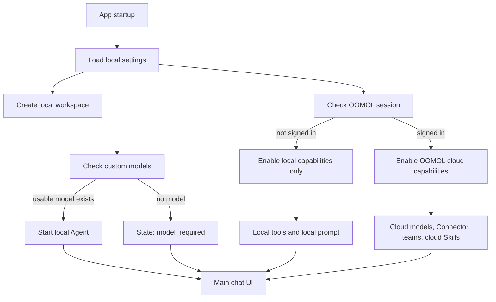

# Wanta Open-Source and Login-Free Mode Implementation Plan

> Status: Draft — in execution. Several items have already landed on `main` and are marked **done**
> inline: the Apache-2.0 `LICENSE` and `README.md` (#197), the `@oomol/*` packages on public npm
> (#195), the organizations→teams rename (#188), and the `package.json` metadata fields.
> Goal: turn Wanta into an open-source desktop app that is login-free by default and supports BYOK
> and local Agent capabilities; OOMOL login becomes the optional upgrade path to cloud models,
> OpenConnector, teams, shared connections, cloud Skills, and billing.

## 1. Background and goals

Wanta today is OOMOL's Electron desktop AI Agent client. The chat UI, OpenCode sidecar, local
tools, permission prompts, Artifacts, document previews, custom models, and the OpenConnector
client side are already a fairly complete product — but the app entry point, Agent lifecycle,
session scoping, and cloud capabilities are all deeply bound to the OOMOL login state.

The core purpose of open-sourcing is not to open up all of OOMOL's cloud infrastructure, but to
let the community:

- study and reuse a mature chat UI and streaming interaction design;
- understand the complete Agent development pattern of Electron + OpenCode + local tools +
  permission UI;
- use the core features without registering an OOMOL account, via their own model API or a local
  compatible service;
- keep using OpenConnector and other officially hosted capabilities after deliberately signing in
  to OOMOL.

The target product must support two runtime modes:

| Mode                 | Login required | Model source                       | Local tools | OpenConnector | Teams/billing |
| -------------------- | -------------: | ---------------------------------- | ----------: | ------------: | ------------: |
| Local community mode |             No | Custom API / local compatible service |   Supported | Not supported | Not supported |
| OOMOL cloud mode     |            Yes | OOMOL built-in models + custom models |   Supported |     Supported |     Supported |

The first open-source release must satisfy:

- a fresh clone requires no OOMOL account;
- a fresh clone requires no private npm PAT — **already true**: the `@oomol/*` packages have been
  on public npm since the org migration (#195);
- the main UI is reachable without login, and local data is manageable there;
- chat works once a custom model is configured;
- local files, Shell, projects, permission prompts, and Artifacts are usable;
- when not signed in, no Connector tools or OOMOL workspace semantics are exposed to the model;
- after signin, all existing OOMOL capabilities keep working;
- signout or session expiry never disables local functionality wholesale;
- the open-source license, brand boundaries, third-party dependencies, and credential storage are
  all clearly settled.

## 2. Scope

### 2.1 First-release open-source core

- Electron main process, preload, and the React renderer;
- chat UI, streaming messages, tool-call rendering, and message actions;
- OpenCode sidecar lifecycle management;
- Build / Plan modes;
- local file, Shell, project, and code capabilities;
- the closed loop between OpenCode permission ask and Wanta's permission UI;
- local session and project management;
- attachments, Artifacts, PDF, Word, image, and Univer spreadsheet previews;
- custom OpenAI-compatible models;
- local Skills and knowledge capabilities that do not depend on an OOMOL account;
- the local workspace;
- the client-side implementation of OOMOL login and OpenConnector;
- development, build, test, security, and contribution documentation.

### 2.2 OOMOL-hosted enhancements

The following capabilities remain hosted services provided by OOMOL; the repo contains only the
client-side integration:

- OOMOL built-in models and the Auto model;
- the OpenConnector server side and hosted credentials;
- teams and shared workspaces;
- team-shared connections;
- the cloud Skills catalog;
- billing and usage;
- OOMOL's auto-update distribution infrastructure.

### 2.3 Out of scope for the first release

- open-sourcing the OOMOL LLM gateway server;
- open-sourcing the OpenConnector server or the credential-hosting system;
- providing a public free model API key;
- community self-hosting of the full OOMOL backend;
- automatically migrating local sessions into a team workspace;
- multi-device sync of local sessions;
- a web version of Wanta;
- a full third-party Connector plugin marketplace.

## 3. Product and architecture decisions

Implementation defaults to the following decisions:

| Decision                                        | Choice                                   | Rationale                                                        |
| ----------------------------------------------- | ---------------------------------------- | ---------------------------------------------------------------- |
| Can the main UI be entered without login        | Yes                                      | The core requirement of login-free mode                          |
| Block app entry when no model is configured     | No — only block sending                  | Users can still browse, manage settings, and add models          |
| Agent state when no model is configured         | `model_required`                         | A missing model must never be misreported as being signed out    |
| Disguise the local identity as a signed-in account | No                                    | Avoids muddling Auth, team, and billing semantics                |
| Local workspace                                 | A formal first-class scope               | Avoids a long-lived fake-team implementation                     |
| Keep local sessions after signin                | Yes                                      | Local and cloud data must coexist                                |
| Auto-upload or migrate local sessions           | Never automatically                      | Never change data ownership without confirmation                 |
| Stop the whole Agent on signout                 | No                                       | Only remove OOMOL cloud capabilities and fall back to local models |
| Always install Connector tools                  | No                                       | Tools, permissions, and system prompt must match actual capability |
| Custom model key storage                        | OS-level secure storage                  | BYOK is the community edition's core security boundary           |
| Login page                                      | Kept, but removed from the startup gate  | Login is a capability upgrade, not a precondition for use        |
| Repository strategy                             | Single repo, single mainline, capability layering | Avoids a long-term community/commercial fork              |
| Open-source license                             | Apache-2.0 — **decided; `LICENSE` landed** (#197) | Suits a company-led project and grants an explicit patent license |
| Brand strategy                                  | Code license separated from trademark license | Open-sourcing the code does not license brand redistribution |

## 4. Target runtime model

### 4.1 Decouple identity, workspace, model, and capabilities

Today the login state simultaneously decides the app entry point, workspace, sessions, Agent,
models, and Connector. The target architecture splits this into four independent states.

Note on naming: after the organizations→teams rename (#188), the codebase's workspace concept is
called **team** throughout — `SessionScope.teamId`/`teamName`, `ChatRunWorkspace.teamId`/`teamName`,
`useTeamWorkspace`, `useTeamSkills`, `SetAgentTeamRequest.teamName`, among others. Only external
protocol headers such as `x-oo-organization-name` keep the "organization" wording. Search and
refactor by the team-based names — never by the legacy ones.

```ts
interface ApplicationRuntimeState {
  identity: IdentityState
  workspace: WorkspaceScope
  model: ModelRuntimeState
  capabilities: RuntimeCapabilities
}

type IdentityState = { kind: "local" } | { kind: "oomol"; account: AuthAccountSummary }

type WorkspaceScope =
  | {
      kind: "local"
      workspaceId: string
      workspaceName: string
    }
  | {
      kind: "team"
      teamId: string
      teamName: string
    }

type ModelRuntimeState =
  | { status: "model_required" }
  | { status: "ready"; selected: ModelChoice }
  | { status: "error"; message: string }

interface RuntimeCapabilities {
  localAgent: boolean
  localTools: boolean
  customModels: boolean
  oomolCloudModels: boolean
  connectors: boolean
  teams: boolean
  billing: boolean
  cloudSkills: boolean
  voice: boolean
}
```

Responsibilities of each state:

- `AuthState` describes only the OOMOL login state;
- `WorkspaceScope` describes the data ownership of sessions and projects;
- `ModelRuntimeState` decides whether the Agent can answer at all;
- `RuntimeCapabilities` decides which capabilities the UI, tools, permissions, and system prompt
  expose.

Never bypass the existing login gate by fabricating a fake `authenticated` local account.

### 4.2 Startup flow



## 5. Implementation stages

### Stage 0: open-source audit and license decision

#### Goal

Establish the publication and redistribution boundaries for code, brand assets, binaries, Skills,
and dependencies.

#### Work items

1. Decide the main code license — **done**: Apache-2.0 was chosen and `LICENSE` landed at the repo
   root (#197);
2. Add `NOTICE`, `TRADEMARKS.md`, and `THIRD_PARTY_NOTICES.md` (`LICENSE` is already in; these
   three still do not exist);
3. Audit `@oomol/connection`, `@oomol/connection-electron-adapter`, the oo CLI, built-in Skills,
   OpenCode, WikiGraph, ai-elements, Univer, and third-party app logos (the two
   `@oomol/connection*` packages are already on public npm — see Stage 8);
4. For every dependency, record: can the source be published, can it be redistributed, is it
   required for a community build, and what is the planned handling;
5. Scan the complete Git history for tokens, API keys, `.env` files, internal addresses, test
   accounts, customer information, signing material, and private assets;
6. When a real secret is found, rotate it first — then decide whether to rewrite history;
7. Draw an explicit responsibility boundary between OOMOL-hosted services and the open-source
   client.

#### Acceptance criteria

- License confirmed by the company — **done** (Apache-2.0); trademark policy confirmation still
  pending;
- every private dependency has an explicit handling plan;
- redistribution rights for the oo CLI and Skills are settled;
- the full Git history secret scan is complete;
- no release blocker is waved through on default assumptions alone.

### Stage 1: establish the runtime capability model

#### Goal

Break the state coupling of "not signed in means the app and Agent cannot run".

#### Work items

1. Add the runtime capability model;
2. Change the Agent state to `starting | ready | model_required | error`;
3. Keep `AuthState`, but use it only for OOMOL identity and cloud capabilities;
4. Stop the renderer from deriving overall feature availability from `authenticated`;
5. Add pure-function tests for local, OOMOL, token expiry, and missing-model states.

#### Primary affected files

- `electron/auth/common.ts`
- `electron/main.ts`
- `electron/chat/common.ts`
- `electron/chat/node.ts`
- `src/hooks/useAuth.ts`
- `src/components/AppDataProvider.tsx`
- `src/components/app-shell/AppShell.tsx`

#### Acceptance criteria

- Auth and the Agent runtime are independent concepts;
- local capabilities remain available when not signed in;
- token expiry only shuts off cloud capabilities — it never deletes local models or local sessions;
- no fake local signed-in account exists.

### Stage 2: introduce the local workspace

#### Goal

Give not-signed-in users formal data ownership and a session scope.

#### Work items

1. Extend `SessionScope` into a `local | team` union type (today it is `{ teamId, teamName }`);
2. Define a stable default local workspace ID and name;
3. Compatibility reads for legacy data that only carries `organizationId` and `organizationName`
   **already exist** — `normalizeSessionScopeValue` in `electron/session/common.ts` falls back to
   the legacy fields and maps them to `teamId`/`teamName`. Keep that fallback intact; the remaining
   work in this item is only adding the `local` variant to the union, not building a new
   `organization*` compat layer;
4. New data writes the scope kind explicitly;
5. When not signed in, auto-select the local workspace and issue no team API requests;
6. After signin, keep the local workspace and allow switching to team workspaces;
7. Never auto-migrate, copy, or upload local sessions;
8. Add tests for sessions, projects, archives, and legacy-data migration.

#### Primary affected files

- `electron/session/common.ts`
- `electron/session/node.ts`
- `electron/session/metadata-store.ts`
- `electron/session/project-store.ts`
- `src/components/app-shell/app-shell-model.ts`
- `src/hooks/useTeamWorkspace.ts`
- `src/components/app-shell/AppShell.tsx`

#### Acceptance criteria

- local sessions can be created, read, and restored fully offline;
- the local scope and team scopes never conflict;
- signin, signout, and account switching never delete local sessions;
- legacy team sessions — including pre-rename records carrying `organization*` fields — still read
  correctly.

### Stage 3: support the not-signed-in Agent and BYOK

#### Goal

As long as one usable custom model exists, a not-signed-in user can start the OpenCode Agent.

#### Design

```ts
/** Lives only in the Electron main process — never in preload, renderer state, or IPC/RPC contracts. */
type MainProcessCloudRuntime =
  | { kind: "local" }
  | {
      kind: "oomol"
      sessionToken: string
      teamName?: string
    }

/** Credential-free capability summary that may cross the preload/renderer boundary. */
type RuntimeCapabilities =
  | { kind: "local"; connector: false }
  | { kind: "oomol"; connector: true; teamName?: string }

interface AgentManagerOptions {
  cloudRuntime: MainProcessCloudRuntime
  selectedModel: ModelChoice
  customModels: PersistedCustomModel[]
  opencodeBinPath: string
  rootDir: string
}
```

Local mode:

- generate no OOMOL builtin provider;
- require no OOMOL token;
- register only user-configured custom providers;
- with no model, never start the sidecar — state is `model_required`;
- never pass an empty string as a token or API key;
- generate no oo CLI environment.

OOMOL mode:

- keep the existing builtin providers and Auto;
- keep the session token security boundary;
- keep supporting custom providers;
- signin, signout, and model changes rebuild the sidecar safely through the same serial assembly
  chain.

#### Lifecycle requirements

- custom model present at startup: start the local runtime;
- OOMOL session present at startup: enable the OOMOL runtime;
- no model at all: enter `model_required`;
- first model added: start the Agent automatically;
- last model deleted: enter `model_required`;
- signout with a custom model: fall back to the local runtime;
- signout without a custom model: keep the app usable and enter `model_required`.

#### Primary affected files

- `electron/agent/manager.ts`
- `electron/agent/config.ts`
- `electron/main.ts`
- `electron/models/node.ts`
- `electron/models/store.ts`
- `electron/chat/node.ts`

#### Acceptance criteria

- a custom model completes a chat with no OOMOL cookie present;
- local Shell, file, and project tools work;
- the app does not crash when no model exists;
- adding, deleting, and switching models refreshes the runtime safely;
- no OOMOL session token exists in the local runtime environment;
- renderer state and IPC/RPC payloads never contain `sessionToken` — only the credential-free
  `RuntimeCapabilities` is exposed.

### Stage 4: assemble the system prompt and Connector tools by capability

#### Goal

Make the tools, permissions, and system prompt the model sees match actual capability.

#### Work items

1. Split the system prompt into sections such as core, local work, knowledge, connector, output,
   and plan;
2. Add a capability-based prompt composition function;
3. In local mode, never write `list_apps`, `search_actions`, `inspect_action`, or `call_action`;
4. In local mode, inject no `OO_API_KEY`, Connector URL, or team scope;
5. In OOMOL mode, keep the existing four tools, authorization semantics, canary, rate limiting,
   and circuit breaker;
6. Whenever the capability policy changes, check tools, agent permission, root permission, and
   system prompt together;
7. Build snapshot/assertion tests for the config and prompt of both runtimes.

#### Primary affected files

- `electron/agent/system-prompt.ts`
- `electron/agent/config.ts`
- `electron/agent/workspace.ts`
- `electron/agent/tool-sources.ts`
- `electron/agent/oo.ts`
- `electron/agent/manager.ts`

#### Acceptance criteria

- in local mode, Connector tools exist neither in the prompt nor in the OpenCode workspace;
- no `OO_API_KEY` exists in the local-mode environment;
- no functional regression on the OOMOL-mode Connector critical path;
- Build / Plan permission semantics and the permission-ask UI loop stay intact.

### Stage 5: remove the login wall and add first-run onboarding

#### Goal

Users land in the main UI on launch; login becomes an optional action.

#### Work items

1. Turn `AuthGate` into an entry gate that only waits for runtime initialization;
2. With no model, show a model-configuration CTA but never block app entry;
3. With a model present, start local chat directly;
4. Move the OOMOL login entry points to the sidebar account menu, the settings page, the models
   page, and the Connector CTA;
5. Keep the former LoginRoute as a login page or dialog — no longer the default startup barrier;
6. In local mode, hide or explicitly disable Billing, Teams, cloud Connections, cloud Skills, and
   cloud usage;
7. Cloud pages must never explain "you need to sign in" through a pile of 401s;
8. Complete the Chinese and English onboarding, error, and capability copy.

Recommended first-run onboarding copy:

> Configure a model to start chatting. You can use your own API, or sign in to OOMOL to use cloud
> models and connectors.

#### Primary affected files

- `src/App.tsx`
- `src/hooks/useAuth.ts`
- `src/components/AuthenticatedAppShell.tsx`
- `src/components/app-shell/AppShell.tsx`
- `src/routes/Login/`
- `src/routes/Settings/`
- model, sidebar, and navigation components
- Chinese and English i18n

#### Acceptance criteria

- restarting after clearing cookies never shows a forced login wall;
- the Local workspace is reachable without signin;
- with no model, a clear configuration entry point exists;
- a failed login never affects local chat;
- after signout, the user stays in the main UI.

### Stage 6: stabilize switching between local and OOMOL modes

#### Goal

Make signin, signout, token expiry, and account switching safe and predictable.

#### After signin

- keep the local workspace and local sessions;
- load teams, OOMOL builtin models, and the Connector capability;
- rebuild the Agent runtime safely;
- show Connections, Billing, Teams, and cloud Skills;
- never auto-upload or change the ownership of current local sessions.

#### After signout or token expiry

- clear cookies and runtime tokens;
- fully stop the old token-carrying sidecar;
- remove the Connector and team capabilities;
- clear the previous account's cloud caches;
- switch to the local workspace;
- with a custom model, start the local runtime;
- without a custom model, enter `model_required`;
- never delete local data.

#### Error boundaries

- only a 401 from an OOMOL service triggers OOMOL session expiry;
- a 401 from a custom provider only prompts checking that model's API key;
- a canceled or failed login never affects local capabilities;
- when switching runtimes mid-generation, stop the old generation and sidecar first, then start
  the new runtime;
- keep using the serial apply chain — two sidecars must never share the same workspace
  concurrently.

#### Acceptance matrix

| Scenario                         | Expected                                                    |
| -------------------------------- | ----------------------------------------------------------- |
| Signin succeeds from local mode  | OOMOL capabilities added, local data preserved              |
| Login canceled or failed         | Local functionality unaffected                              |
| Signout from OOMOL mode          | Falls back to local mode                                    |
| OOMOL token expires              | Falls back to local mode with a notice                      |
| Custom model API 401             | Does not trigger OOMOL signout                              |
| Signed-in account switched       | Previous account's cloud caches cleared, local data preserved |
| Signout mid-generation           | Old generation stopped, runtime rebuilt safely              |
| Signout with no custom model     | `model_required`, app remains usable                        |

### Stage 7: protect custom model credentials

#### Goal

Make BYOK a security capability the project can publicly commit to.

#### Work items

1. Introduce a `ModelCredentialStore`;
2. Store API keys via Electron `safeStorage` or OS-level secure storage;
3. The model metadata file stores only `apiKeyConfigured` — never a plaintext key;
4. The renderer only ever sees redacted model summaries;
5. Add an atomic migration for legacy plaintext keys: write to secure storage first, then clear
   the old field;
6. A failed migration must never delete the only valid credential;
7. Deleting a model deletes its secure credential;
8. Logs, diagnostics, error reports, and settings exports must never contain keys;
9. When Linux secure storage is unavailable, warn explicitly — never silently degrade to
   plaintext.

#### Acceptance criteria

- `models.json` contains no plaintext keys;
- the renderer, logs, and diagnostic files contain no keys;
- legacy-data migration and failure rollback are tested;
- the OOMOL token and model keys use separate storage and lifecycles.

### Stage 8: remove private dependencies from community installs

#### Goal

The public repo installs and runs its core features in an environment with no PAT, no cookies,
and no oo CLI. The PAT half is **done** (#195); oo CLI optionalization is the remaining open work
in this stage.

#### `@oomol/connection*` handling order

1. Preferred: publish `@oomol/connection` and `@oomol/connection-electron-adapter` as public
   packages — **done** (#195): both resolve from the public npm registry, the repo has no
   `.npmrc`, and CI passes no `NODE_AUTH_TOKEN`;
2. (fallback — no longer needed) if standalone publishing did not suit, migrate the implementation
   into repo workspace packages;
3. (fallback — no longer needed) if publication was impossible, replace with a public or in-house
   type-safe Electron IPC layer;
4. Regardless of the option taken, the security boundary must survive: credentials never enter the
   renderer. This invariant remains binding.

#### Making the oo CLI optional

- `postinstall` no longer treats the oo download as a community-core prerequisite;
- `predev` no longer blocks local mode when oo is missing;
- the local runtime neither resolves nor injects oo;
- oo is checked only when the OOMOL Connector capability is enabled;
- official release packages may keep bundling oo;
- community builds may produce an app without oo;
- when oo is missing, only mark the Connector as unavailable.

#### package metadata

- Add `license`, `repository`, `homepage`, and `bugs` — **done**: all four fields are present in
  `package.json`;
- remove the fresh-clone dependence on an internal `.npmrc` and PAT — **done** (#195);
- declare explicit Node/npm versions;
- update the install and build documentation.

#### Acceptance criteria

In a fresh environment with no PAT, cookies, `.oo-bin`, internal `.npmrc`, or internal environment
variables, all of the following succeed:

```bash
npm install
npm run ts-check
npm run lint
npm run format
npm test
npm run build
npm run dev
```

### Stage 9: open-source documentation and contribution system

#### Must add or rewrite

- `README.md` — **landed** (#197); verify it covers positioning, screenshots, Quick Start, BYOK,
  local/OOMOL modes, architecture, security, and roadmap;
- `CONTRIBUTING.md`: branching, PRs, quality gates, UI verification, coding and security hard
  rules (still missing);
- `SECURITY.md`: vulnerability reporting, credential storage, the renderer boundary, log
  redaction, and the threat model (still missing);
- `LICENSE` — **landed** (#197); `NOTICE`, `TRADEMARKS.md`, and `THIRD_PARTY_NOTICES.md` still
  missing;
- docs for the runtime, session scope, Agent sidecar, IPC, Connector adapter, and the permission
  loop;
- issue/PR templates and label planning such as `good first issue` and `help wanted`.

#### The README must make clear

- Wanta is not just a chat-bubble UI — it is a complete desktop Agent client;
- it is usable without login via BYOK;
- signing in to OOMOL unlocks hosted models and OpenConnector;
- the repo does not contain the OOMOL cloud server side;
- the brand-usage restrictions that apply to third-party redistribution;
- how custom API keys and the OOMOL token are stored, and their data flow.

#### Acceptance criteria

A new contributor with no prior involvement can — using only the repo docs — install, add a model,
chat, run the tests, and land a small PR.

### Stage 10: release validation

#### Automated quality gates

Every code PR must pass:

```bash
npm run ts-check
npm run lint
npm run format
npm test
npm run build
```

Add a community-build CI job:

- provides no `NODE_AUTH_TOKEN`;
- downloads no oo;
- provides no OOMOL cookie;
- runs install, lint, format, ts-check, test, and build.

Keep the OOMOL integration build to validate the Connector runtime and official packaging assets.

#### Runtime test matrix

Local community mode:

- fresh install, no network, no model;
- adding, switching, and deleting models;
- custom provider 401, timeout, and missing tool-call support;
- image input;
- local sessions, projects, files, Shell, and permission prompts;
- Artifacts, Univer, PDF, and Word;
- sidecar reclamation after app restart and abnormal exit.

OOMOL mode:

- browser login and deep-link;
- login cancellation, token expiry, and account switching;
- team switching;
- Connector search/inspect/call;
- Connector authorization and credential expiry;
- signout fallback to local;
- Billing, Skills, and update checks.

Security checks:

- the OOMOL token and custom API keys never enter the renderer;
- renderer state and IPC/RPC payloads contain no `sessionToken`;
- `auth.json` stores only the profile — no credential in any form — keeps `0600` permissions, and
  uses atomic writes; model metadata contains no plaintext credentials;
- logs and deep-links are always fully redacted, especially queries containing `authID`;
- local attachments and sessions are never auto-uploaded after signin;
- the community build contains no private registry, internal credentials, or development
  endpoints.

## 6. Recommended PR breakdown

All branch names, commit messages, PR titles, and descriptions are in English.

| PR  | Suggested branch name                | Content                                                                 | Depends on          |
| --- | ------------------------------------ | ----------------------------------------------------------------------- | ------------------- |
| 1   | `codex/runtime-capabilities`         | Runtime capabilities and Agent state                                     | None                |
| 2   | `codex/local-workspace`              | Local workspace and SessionScope migration                               | PR 1                |
| 3   | `codex/local-agent-runtime`          | Start a custom-model Agent without an OOMOL token                        | PR 1, 2             |
| 4   | `codex/capability-prompts`           | Capability-based system prompt and Connector tools                       | PR 3                |
| 5   | `codex/passwordless-app-shell`       | Remove the login wall and add model onboarding                           | PR 2, 3             |
| 6   | `codex/cloud-runtime-switching`      | Runtime switching after signin, signout, and expiry                      | PR 3, 4, 5          |
| 7   | `codex/secure-model-credentials`     | API key secure storage and migration                                     | Parallel to PR 4–6  |
| 8   | `codex/public-dependencies`          | Public IPC dependencies (**done**, #195) and oo optionalization (remaining) | Dependency decisions |
| 9   | `codex/open-source-metadata`         | NOTICE and trademark files; LICENSE and package metadata **already landed** | After legal signoff |
| 10  | `codex/community-documentation`      | CONTRIBUTING, SECURITY, and architecture docs (README **landed**, #197)  | After features stabilize |
| 11  | `codex/community-release-validation` | CI, fresh clone, and cross-platform validation                           | All of the above    |

Every PR must keep the existing quality gates green; UI or runtime changes additionally require
the corresponding live verification.

## 7. Milestones

### Milestone A: local MVP

- runtime capabilities;
- local workspace;
- custom-model startup;
- login wall removed;
- no Connector exposure in local mode;
- local sessions and local tools usable.

Result: Wanta's chat and local Agent core are usable without signing in.

### Milestone B: dual-mode stability

- OOMOL enabled after signin;
- fallback to local after signout and token expiry;
- local and team workspaces coexist;
- Connector capability assembled dynamically;
- system prompt composed dynamically.

Result: community mode and the OOMOL-enhanced mode switch stably within one app.

### Milestone C: publicly developable

- private npm dependencies handled — **done** (#195);
- oo made optional;
- fresh clone;
- API key secure storage;
- community CI.

Result: external developers build and contribute without an OOMOL PAT.

### Milestone D: official open-source release

- license (**done**, #197), trademark, and third-party notices;
- Git history audit;
- README (**landed**, #197), CONTRIBUTING, and SECURITY;
- cross-platform builds;
- the first open-source release.

Result: the repo meets the bar of a trustworthy, runnable, contributable, and long-term
maintainable open-source release.

## 8. Rough effort

Rough estimates for one engineer already familiar with the repo; legal approval and cross-team
waits excluded:

| Module                                     | Rough effort |
| ------------------------------------------ | -----------: |
| Runtime capability modeling                |     2–4 days |
| Local workspace and data migration         |     3–5 days |
| Not-signed-in Agent + BYOK                 |     4–7 days |
| Prompt / Connector capability assembly     |     3–5 days |
| Login wall removal and onboarding          |     3–5 days |
| Signin, signout, and expiry switching      |     4–7 days |
| Model credential secure storage            |     3–5 days |
| Private IPC dependency publication/replacement | **done** — published publicly, no remaining work |
| oo CLI optionalization                     |     2–4 days |
| Docs and open-source metadata              |     3–5 days (LICENSE/README/metadata landed; NOTICE, trademarks, CONTRIBUTING, SECURITY remain) |
| CI, cross-platform, and fresh clone validation |  4–7 days |

Suggested pacing:

- locally usable MVP: about 2–3 weeks;
- dual-mode stability: about 3–4 weeks;
- official open-source release quality: about 4–6 weeks;
- the extra 1–2 weeks once reserved for a full rewrite of the private IPC packages is no longer
  needed — they are public.

## 9. Main risks

### 9.1 Implementing local mode as a "fake account"

Risk: team, billing, 401, and data-ownership logic keeps spawning special-case branches.

Control: introduce a formal local identity and local workspace; forging an `authenticated` state
is forbidden.

### 9.2 Agent tools, permissions, and prompt drifting apart

Risk: the model calls a nonexistent Connector, or Plan / Build permission semantics regress.

Control: tools, permission, and system prompt consume the same capability input, plus runtime
composition tests.

### 9.3 Runtime switching producing multiple sidecars

Risk: orphan processes, cross-wired events, workspace conflicts, and token-lifecycle errors.

Control: keep the serial assembly chain — a new instance starts only after the old sidecar is
fully reclaimed — and cover it with concurrency tests.

### 9.4 BYOK credentials stored in plaintext

Risk: user trust and the security boundary cannot hold.

Control: migrate to OS secure storage before the official release; the renderer only ever gets
`apiKeyConfigured`.

### 9.5 Repo public but not installable

Risk: the day-one open-source experience fails and the project is seen as display-only source.

Control: community CI provides no PAT, and Quick Start is independently verified on a clean
machine. The PAT half of this risk is already retired — the `@oomol/*` packages are on public npm
(#195); the CI job exists to keep it that way.

### 9.6 Unclear brand and third-party asset licensing

Risk: forced emergency asset removal after publication, or redistribution disputes.

Control: audit the code license, trademark license, and binary/asset licenses separately and
produce a written inventory. The code license is settled (Apache-2.0, #197); the trademark and
third-party notices are still open.

## 10. Definition of done

Open-sourcing counts as complete only when all of the following hold:

- first launch requires no login;
- users can use their own model API;
- users can complete real chats and local Agent work;
- local sessions and projects persist;
- OOMOL login is an optional capability;
- when not signed in, the model does not know Connector tools exist;
- after signin, existing Connector capabilities show no visible regression;
- local functionality survives signout and token expiry;
- community installs require no private PAT — **already true** (#195);
- the community does not need the oo CLI to run the core;
- custom model keys are never stored in plaintext;
- the repo carries a formal open-source license — **already true** (Apache-2.0, #197);
- trademark and third-party asset licensing are clear;
- the fresh-clone docs are independently verified;
- automated quality gates and cross-platform smoke verification pass.

The critical path is:

```text
Runtime capability
→ Local workspace
→ Local Agent with BYOK
→ Remove login wall
→ Capability-based Connector
→ Stable login/logout switching
→ Public installability
→ Security and release audit
```

The first four items alone yield a local MVP with real product value; the later stages decide
whether the project can go open source in a trustworthy, contributable, and long-term maintainable
way.
